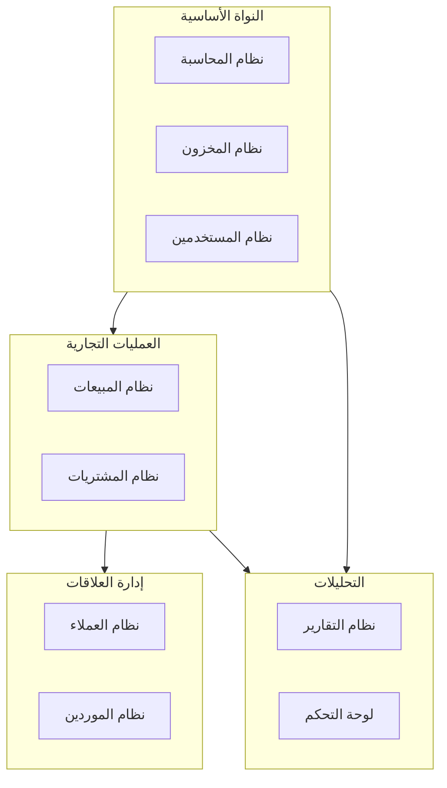
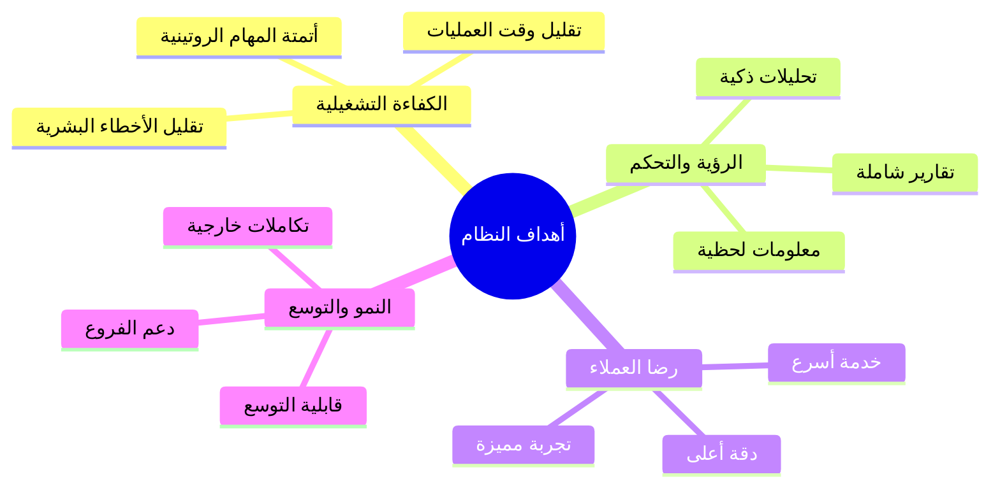
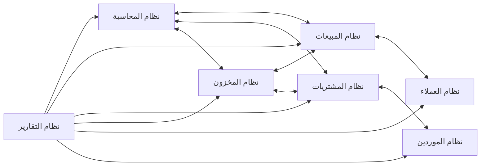
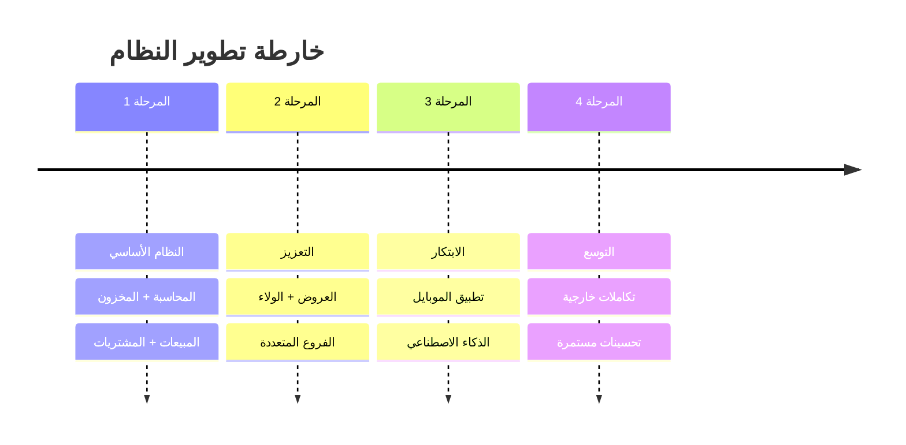

# 📋 نظرة عامة على النظام

## 🎯 مقدمة

نظام **ERP المتكامل للمحلات التجارية** هو حل برمجي شامل يهدف إلى رقمنة وتحسين جميع العمليات التجارية والمحاسبية للمحلات التجارية والسوبر ماركت.

---

## 🏛️ الهيكل العام للنظام

---

## 📊 معلومات المشروع

| البند | التفاصيل |
|-------|----------|
| **اسم المشروع** | نظام ERP المتكامل للمحلات التجارية |
| **الإصدار** | 1.0.0 |
| **الحالة** | قيد التطوير |
| **الفئة المستهدفة** | المحلات التجارية، السوبر ماركت، المطاعم |
| **نطاق التغطية** | فرع واحد إلى عدة فروع |
| **العملة** | الريال السعودي (SAR) |
| **اللغة** | العربية (الافتراضية)، الإنجليزية |

---

## 🎯 الأهداف

### الأهداف الرئيسية

---

## 🧩 المكونات الرئيسية

### 1️⃣ النواة الأساسية

| المكون | الوظيفة |
|--------|---------|
| **نظام المحاسبة** | إدارة الحسابات، القيود، القوائم المالية |
| **نظام المخزون** | تتبع المنتجات، الجرد، التنبيهات |
| **نظام المستخدمين** | الصلاحيات، الأدوار، الأمان |

### 2️⃣ العمليات التجارية

| المكون | الوظيفة |
|--------|---------|
| **نظام المبيعات** | نقاط البيع، الفواتير، المرتجعات |
| **نظام المشتريات** | طلبات الشراء، فواتير الموردين |

### 3️⃣ إدارة العلاقات

| المكون | الوظيفة |
|--------|---------|
| **نظام العملاء** | بيانات العملاء، النقاط، الولاء |
| **نظام الموردين** | تقييم الموردين، العقود، المقارنات |

### 4️⃣ التحليلات والتقارير

| المكون | الوظيفة |
|--------|---------|
| **نظام التقارير** | تقارير متنوعة، تصدير، جدولة |
| **لوحة التحكم** | مؤشرات الأداء، رسوم بيانية |

---

## 🔗 التكامل بين الوحدات

---

## 📈 المؤشرات الرئيسية (KPIs)

| المؤشر | الهدف |
|--------|-------|
| وقت إتمام عملية البيع | < 30 ثانية |
| دقة بيانات المخزون | > 99% |
| توفر النظام | > 99.5% |
| رضا المستخدمين | > 80% |
| تغطية الاختبارات | > 80% |

---

## 🚀 المراحل القادمة

---

## 📞 معلومات الاتصال

| البند | التفاصيل |
|-------|----------|
| **فريق المشروع** | فريق تطوير ERP |
| **تاريخ الإنشاء** | مارس 2026 |
| **آخر تحديث** | مارس 2026 |

---

**الوثيقة:** نظرة عامة على النظام  
**الإصدار:** 1.0  
**تاريخ التحديث:** 2026-03-07
