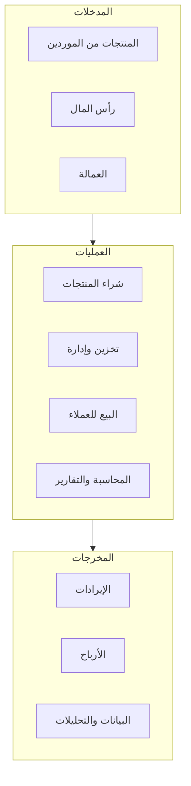
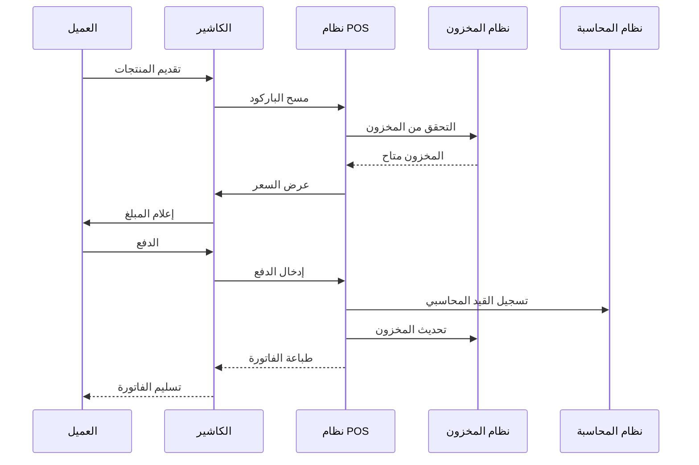
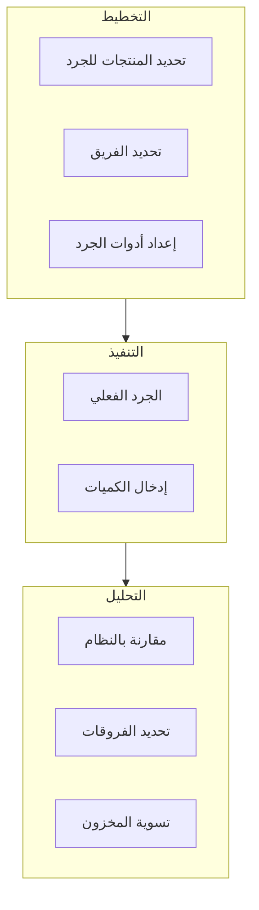
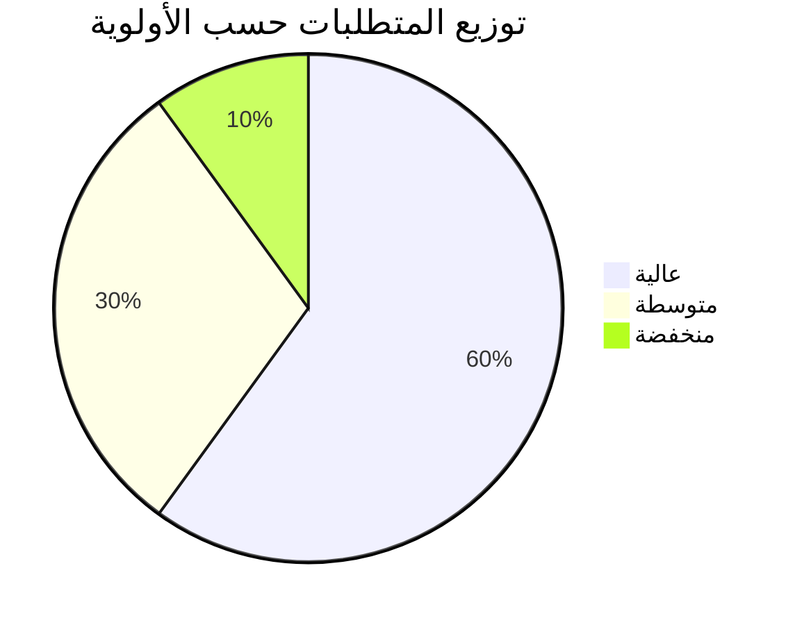

# 📊 تحليل الأعمال

## 🎯 مقدمة

يقدم هذا المستند تحليلاً شاملاً للعمليات التجارية في المحلات التجارية، مع تحديد المتطلبات الوظيفية وغير الوظيفية للنظام.

---

## 🏪 نموذج العمل



---

## 👥 أصحاب المصلحة

### تحليل أصحاب المصلحة

| صاحب المصلحة | الدور | الاحتياجات الرئيسية | الأولوية |
|--------------|------|---------------------|----------|
| **المالك/المدير** | اتخاذ القرارات | تقارير شاملة، مؤشرات أداء | عالية |
| **المحاسب** | إدارة الحسابات | قيود يومية، تقارير مالية | عالية |
| **الكاشير** | إتمام المبيعات | POS سريع، سهل الاستخدام | عالية |
| **أمين المخزن** | إدارة المخزون | تتبع المنتجات، جرد | عالية |
| **مسؤول المشتريات** | شراء المنتجات | إدارة الموردين، طلبات | متوسطة |
| **العملاء** | الشراء | خدمة سريعة، دقة | عالية |

---

## 📋 العمليات الرئيسية

### 1️⃣ عملية البيع



### 2️⃣ عملية الشراء


### 3️⃣ عملية الجرد



---

## 📊 المتطلبات الوظيفية

### متطلبات نظام المبيعات

| المعرف | المتطلب | الوصف | الأولوية |
|--------|---------|-------|----------|
| SAL-001 | نقاط البيع | واجهة سريعة لإتمام المبيعات | عالية |
| SAL-002 | فواتير إلكترونية | إنشاء وطباعة الفواتير | عالية |
| SAL-003 | خصومات وعروض | إدارة العروض الترويجية | متوسطة |
| SAL-004 | مرتجعات | معالجة مرتجعات العملاء | عالية |
| SAL-005 | دفع متعدد | دعم طرق دفع متنوعة | عالية |

### متطلبات نظام المخزون

| المعرف | المتطلب | الوصف | الأولوية |
|--------|---------|-------|----------|
| INV-001 | تتبع المنتجات | تتبع كل منتج بالباركود | عالية |
| INV-002 | حركات المخزون | تسجيل جميع الحركات | عالية |
| INV-003 | تنبيهات نفاد | تنبيه عند وصول حد معين | عالية |
| INV-004 | الجرد | إجراء عمليات الجرد | عالية |
| INV-005 | وحدات قياس | دعم وحدات مختلفة | متوسطة |

### متطلبات نظام المحاسبة

| المعرف | المتطلب | الوصف | الأولوية |
|--------|---------|-------|----------|
| ACC-001 | شجرة حسابات | هيكل حسابات مرن | عالية |
| ACC-002 | قيود يومية | تسجيل القيود المحاسبية | عالية |
| ACC-003 | قوائم مالية | إنشاء القوائم المالية | عالية |
| ACC-004 | ميزان مراجعة | ميزان مراجعة تفصيلي | عالية |
| ACC-005 | دفتر الأستاذ | دفتر أستاذ للحسابات | عالية |

---

## 🔒 المتطلبات غير الوظيفية

### الأداء

| المتطلب | الهدف | القياس |
|---------|-------|--------|
| وقت الاستجابة | < 200ms | 95th percentile |
| إتمام عملية البيع | < 30 ثانية | من البداية للنهاية |
| تحميل الصفحات | < 2 ثانية | الصفحات الرئيسية |

### الأمان

| المتطلب | الوصف |
|---------|-------|
| المصادقة | تسجيل دخول آمن مع MFA |
| التفويض | صلاحيات基于 الأدوار |
| التشفير | TLS 1.3 للاتصالات |
| النسخ الاحتياطي | نسخ يومي تلقائي |

### القابلية للاستخدام

| المتطلب | الهدف |
|---------|-------|
| سهولة الاستخدام | تدريب < 8 ساعات |
| الوصولية | دعم لوحة المفاتيح |
| التعريب | دعم كامل للعربية |
| الاستجابة | يعمل على جميع الأجهزة |

---

## 📈 تحليل SWOT

```mermaid
quadrantChart
    title تحليل SWOT للنظام
    quadrant تهددات Threats
    quadrant فرص Opportunities
    quadrant نقاط ضعف Weaknesses
    quadrant نقاط قوة Strengths
    "تكامل شامل": [0.8, 0.8]
    "تقنيات حديثة": [0.7, 0.7]
    "واجهة عربية": [0.6, 0.9]
    "قابلية التوسع": [0.9, 0.6]
    "وقت التطوير": [0.3, 0.4]
    "تكلفة أولية": [0.2, 0.3]
    "منافسة سوقية": [0.3, 0.2]
    "تغير التقنيات": [0.2, 0.4]
```

---

## 💰 تحليل التكلفة والفائدة

### التكلفة

| البند | التكلفة (سنوياً) |
|-------|------------------|
| تطوير النظام | $270,000 (مرة واحدة) |
| الاستضافة السحابية | $6,000 |
| التراخيص والأدوات | $2,000 |
| الصيانة والدعم | $12,000 |

### الفائدة

| البند | التوفير/القيمة |
|-------|----------------|
| تقليل الأخطاء | 30% |
| تسريع العمليات | 50% |
| تحسين إدارة المخزون | 20% |
| زيادة رضا العملاء | 25% |

---

## 📋 ملخص المتطلبات



---

**الوثيقة:** تحليل الأعمال  
**الإصدار:** 1.0  
**تاريخ التحديث:** 2026-03-07
