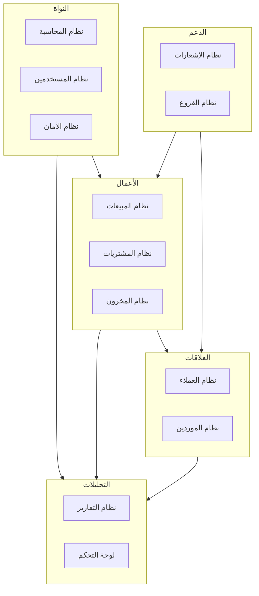
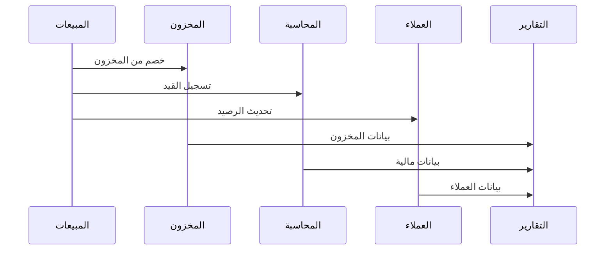
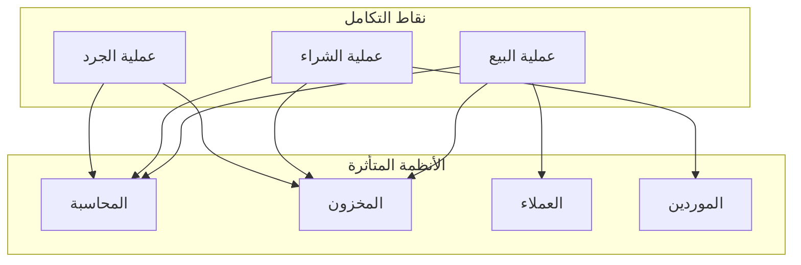

# 🧩 الوحدات النظامية

## 🎯 مقدمة

يحتوي نظام ERP على وحدات متكاملة تعمل معاً لتوفير حل شامل لإدارة المحلات التجارية.

---

## 🏛️ هيكل الوحدات

---

## 📦 الوحدات الرئيسية

### 1️⃣ نظام المحاسبة 💰

**المكونات:**
- شجرة حسابات متكاملة
- قيود يومية آلية
- دفتر أستاذ تفصيلي
- ميزان مراجعة
- قائمة دخل
- ميزانية عمومية
- تدفق نقدي

---

### 2️⃣ نظام المبيعات 🛒

**المكونات:**
- واجهة POS سريعة
- فواتير إلكترونية
- مرتجعات المبيعات
- عروض وخصومات
- أنواع أسعار متعددة
- دفع آجل ونقدي

---

### 3️⃣ نظام المشتريات 📦

**المكونات:**
- طلبات شراء مع موافقات
- فواتير شراء
- مرتجعات للموردين
- مقارنة أسعار الموردين
- أوامر شراء
- عروض أسعار

---

### 4️⃣ نظام المخزون 📋

**المكونات:**
- إدارة المنتجات
- الباركود
- المستودعات المتعددة
- حركات المخزون
- الجرد والتسوية
- تنبيهات نفاد

---

### 5️⃣ نظام العملاء 👥

**المكونات:**
- بطاقات العملاء
- تصنيف العملاء
- نظام النقاط
- برنامج الولاء
- تحليل RFM
- كشف حساب

---

### 6️⃣ نظام الموردين 🏭

**المكونات:**
- بطاقات الموردين
- تقييم الأداء
- إدارة العقود
- مقارنة الأسعار
- كشف حساب

---

### 7️⃣ نظام التقارير 📈

**المكونات:**
- تقارير مبيعات
- تقارير مخزون
- تقارير مالية
- تقارير عملاء
- لوحة تحكم تفاعلية
- تصدير متعدد الصيغ

---

## 🔗 التكامل بين الوحدات

### تدفق البيانات

### القيود المحاسبية الآلية

| العملية | القيد المحاسبي |
|---------|----------------|
| **بيع نقدي** | من: الصندوق / إلى: المبيعات |
| **بيع آجل** | من: ذمم العملاء / إلى: المبيعات |
| **شراء نقدي** | من: المشتريات / إلى: الصندوق |
| **شراء آجل** | من: المشتريات / إلى: ذمم الموردين |
| **مرتجع مبيعات** | من: المبيعات المرتجعة / إلى: ذمم العملاء |

---

## 📊 جدول الوحدات

| الوحدة | الحالة | الأولوية | التكامل |
|--------|--------|----------|---------|
| المحاسبة | ✅ جاهز | عالية | الكل |
| المخزون | ✅ جاهز | عالية | المبيعات، المشتريات |
| المبيعات | ✅ جاهز | عالية | المحاسبة، المخزون |
| المشتريات | ✅ جاهز | عالية | المحاسبة، المخزون |
| العملاء | ✅ جاهز | متوسطة | المبيعات |
| الموردين | ✅ جاهز | متوسطة | المشتريات |
| التقارير | ✅ جاهز | عالية | الكل |
| الفروع | 🔄 قيد التطوير | متوسطة | الكل |

---

## 🎯 نقاط التكامل الرئيسية

---

**الوثيقة:** الوحدات النظامية  
**الإصدار:** 1.0  
**تاريخ التحديث:** 2026-03-07
