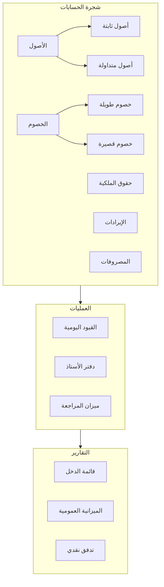
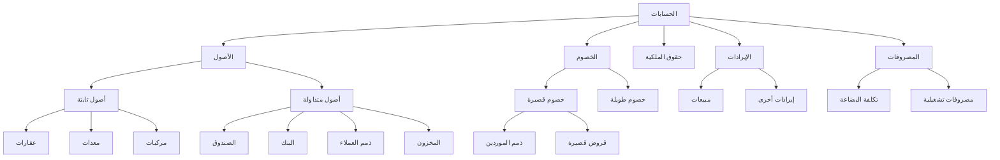
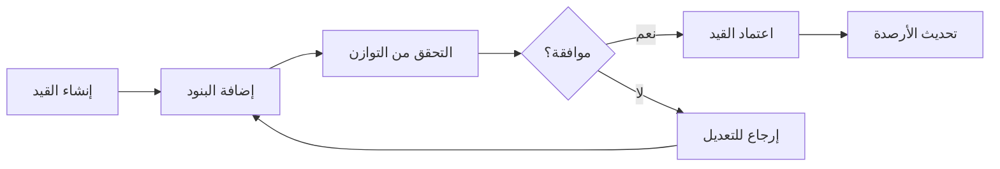

# 💰 نظام المحاسبة

## 🎯 مقدمة

نظام المحاسبة هو النواة الأساسية لـ ERP، يوفر هيكل محاسبي متكامل يتبع المعايير المحاسبية الدولية مع مراعاة المتطلبات المحلية.

---

## 🏛️ هيكل النظام المحاسبي



---

## 📊 شجرة الحسابات

### الهيكل الشجري



### جدول الحسابات الرئيسية

| الكود | الحساب | النوع | الطبيعة |
|-------|--------|-------|---------|
| 1000 | الأصول | رئيسي | مدين |
| 1100 | أصول ثابتة | رئيسي | مدين |
| 1200 | أصول متداولة | رئيسي | مدين |
| 1201 | الصندوق | فرعي | مدين |
| 1202 | البنك | فرعي | مدين |
| 1203 | ذمم العملاء | فرعي | مدين |
| 1204 | المخزون | فرعي | مدين |
| 2000 | الخصوم | رئيسي | دائن |
| 2100 | ذمم الموردين | فرعي | دائن |
| 4000 | الإيرادات | رئيسي | دائن |
| 4100 | مبيعات | فرعي | دائن |
| 5000 | المصروفات | رئيسي | مدين |
| 5100 | تكلفة البضاعة | فرعي | مدين |

---

## 📝 القيود اليومية

### سير العمل



### القيود المحاسبية الشائعة

#### 1️⃣ بيع نقدي

```
من حـ الصندوق (مدين)          1,150.00
    إلى حـ المبيعات (دائن)              1,000.00
    إلى حـ ضريبة القيمة المضافة (دائن)   150.00
```

#### 2️⃣ بيع آجل

```
من حـ ذمم العملاء (مدين)      1,150.00
    إلى حـ المبيعات (دائن)              1,000.00
    إلى حـ ضريبة القيمة المضافة (دائن)   150.00
```

#### 3️⃣ شراء نقدي

```
من حـ المشتريات (مدين)        1,000.00
من حـ ضريبة القيمة المضافة (مدين) 150.00
    إلى حـ الصندوق (دائن)               1,150.00
```

#### 4️⃣ شراء آجل

```
من حـ المشتريات (مدين)        1,000.00
من حـ ضريبة القيمة المضافة (مدين) 150.00
    إلى حـ ذمم الموردين (دائن)          1,150.00
```

---

## 📒 دفتر الأستاذ

### بطاقة حساب

```
┌─────────────────────────────────────────────────────────────────┐
│                    بطاقة حساب                                   │
├─────────────────────────────────────────────────────────────────┤
│ الحساب: ذمم العملاء    الكود: 1203                              │
├──────────┬────────────┬────────┬────────┬────────┬──────────────┤
│ التاريخ  │ البيان     │ مدين   │ دائن   │ الرصيد │ المرجع       │
├──────────┼────────────┼────────┼────────┼────────┼──────────────┤
│ 01/01    │ رصيد افتتاح│ 5,000  │ -      │ 5,000  │ -            │
│ 05/01    │ فاتورة 101 │ 1,150  │ -      │ 6,150  │ INV-101      │
│ 10/01    │ سند قبض    │ -      │ 2,000  │ 4,150  │ REC-001      │
│ 15/01    │ فاتورة 102 │ 2,300  │ -      │ 6,450  │ INV-102      │
├──────────┼────────────┼────────┼────────┼────────┼──────────────┤
│          │ الإجمالي   │ 8,450  │ 2,000  │ 6,450  │              │
└──────────┴────────────┴────────┴────────┴────────┴──────────────┘
```

---

## ⚖️ ميزان المراجعة

### الهيكل

```
┌─────────────────────────────────────────────────────────────────┐
│                    ميزان المراجعة                               │
│                    حتى 31 يناير 2026                            │
├──────────────────┬──────────────┬──────────────┬────────────────┤
│ الحساب           │ مدين         │ دائن         │ ملاحظات        │
├──────────────────┼──────────────┼──────────────┼────────────────┤
│ الصندوق          │ 15,000       │ -            │                │
│ البنك            │ 50,000       │ -            │                │
│ ذمم العملاء      │ 25,000       │ -            │                │
│ المخزون          │ 80,000       │ -            │                │
│ ذمم الموردين     │ -            │ 30,000       │                │
│ القروض           │ -            │ 40,000       │                │
│ رأس المال        │ -            │ 100,000      │                │
│ المبيعات         │ -            │ 200,000      │                │
│ المشتريات        │ 120,000      │ -            │                │
│ المصروفات        │ 80,000       │ -            │                │
├──────────────────┼──────────────┼──────────────┼────────────────┤
│ الإجمالي         │ 370,000      │ 370,000      │ ✅ متوازن      │
└──────────────────┴──────────────┴──────────────┴────────────────┘
```

---

## 📊 القوائم المالية

### 1️⃣ قائمة الدخل

```
┌─────────────────────────────────────────────────────────────────┐
│                    قائمة الدخل                                  │
│                    للفترة من 1/1/2026 إلى 31/1/2026             │
├─────────────────────────────────────────────────────────────────┤
│ الإيرادات:                                                      │
│   المبيعات                              200,000                 │
│   إيرادات أخرى                            5,000                 │
│                                         ─────────               │
│   إجمالي الإيرادات                      205,000                 │
│                                                                 │
│ تكلفة البضاعة المباعة:                                          │
│   المخزون الافتتاحي                      50,000                 │
│   + المشتريات                           120,000                 │
│   - المخزون الختامي                     (80,000)                │
│                                         ─────────               │
│   تكلفة البضاعة المباعة                 (90,000)                │
│                                                                 │
│                                         ─────────               │
│ إجمالي الربح                            115,000                 │
│                                                                 │
│ المصروفات التشغيلية:                                            │
│   الرواتب                               (40,000)                │
│   الإيجار                               (15,000)                │
│   المرافق                               (5,000)                 │
│   مصروفات أخرى                          (20,000)                │
│                                         ─────────               │
│   إجمالي المصروفات                      (80,000)                │
│                                                                 │
│                                         ═════════               │
│ صافي الربح قبل الضريبة                   35,000                 │
│ الضريبة (15%)                            (5,250)                │
│                                         ═════════               │
│ صافي الربح                               29,750                 │
└─────────────────────────────────────────────────────────────────┘
```

### 2️⃣ الميزانية العمومية

```
┌─────────────────────────────────────────────────────────────────┐
│                    الميزانية العمومية                           │
│                    في 31 يناير 2026                             │
├─────────────────────────────────────────────────────────────────┤
│ الأصول:                                                         │
│   الأصول الثابتة:                                               │
│     العقارات                             150,000                │
│     المعدات                               50,000                │
│                                          ─────────              │
│                                          200,000                │
│   الأصول المتداولة:                                             │
│     الصندوق                               15,000                │
│     البنك                                 50,000                │
│     ذمم العملاء                           25,000                │
│     المخزون                               80,000                │
│                                          ─────────              │
│                                          170,000                │
│                                          ═════════              │
│ إجمالي الأصول                            370,000                │
│                                                                 │
│ الخصوم وحقوق الملكية:                                           │
│   الخصوم:                                                       │
│     ذمم الموردين                          30,000                │
│     القروض                                40,000                │
│                                          ─────────              │
│                                          70,000                 │
│   حقوق الملكية:                                                 │
│     رأس المال                            100,000                │
│     الأرباح المحتجزة                      29,750                │
│     الاحتياطيات                          170,250                │
│                                          ─────────              │
│                                          300,000                │
│                                          ═════════              │
│ إجمالي الخصوم وحقوق الملكية              370,000                │
└─────────────────────────────────────────────────────────────────┘
```

---

## 🔧 الإعدادات

### إعدادات السنة المالية

| الإعداد | القيمة |
|---------|--------|
| بداية السنة المالية | 1 يناير |
| نهاية السنة المالية | 31 ديسمبر |
| العملة الأساسية | ريال سعودي (SAR) |
| نسبة الضريبة | 15% |

---

**الوثيقة:** نظام المحاسبة  
**الإصدار:** 1.0  
**تاريخ التحديث:** 2026-03-07
