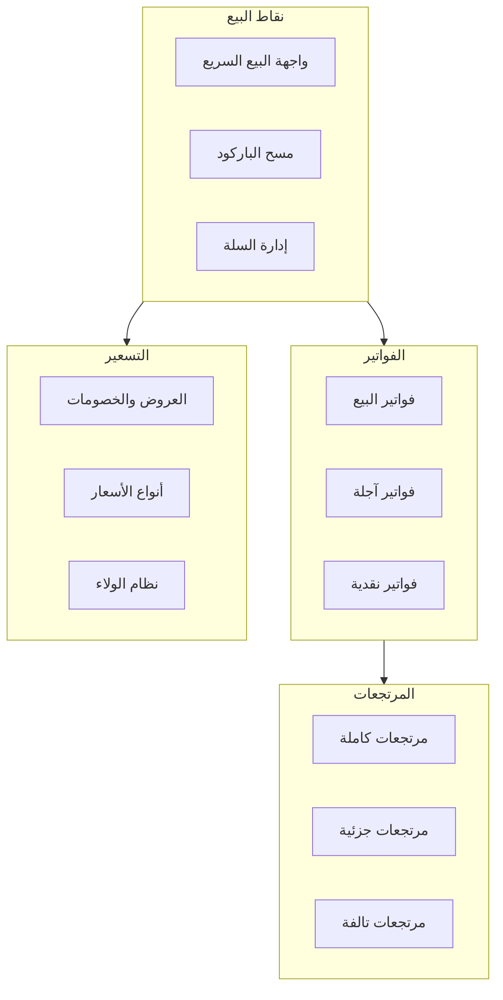
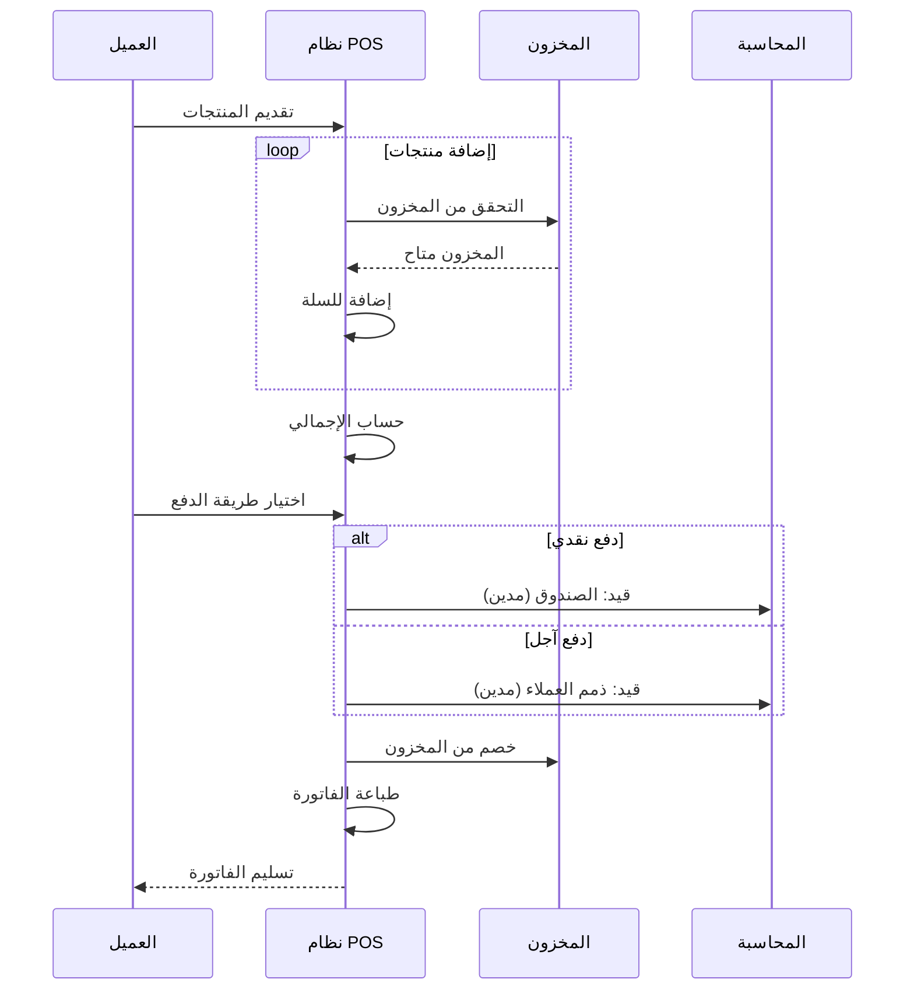
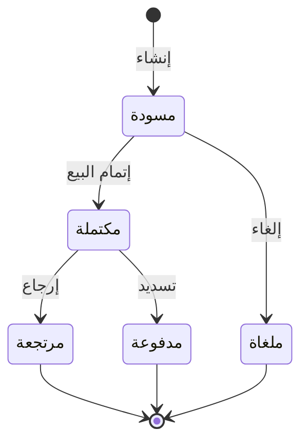
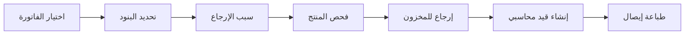
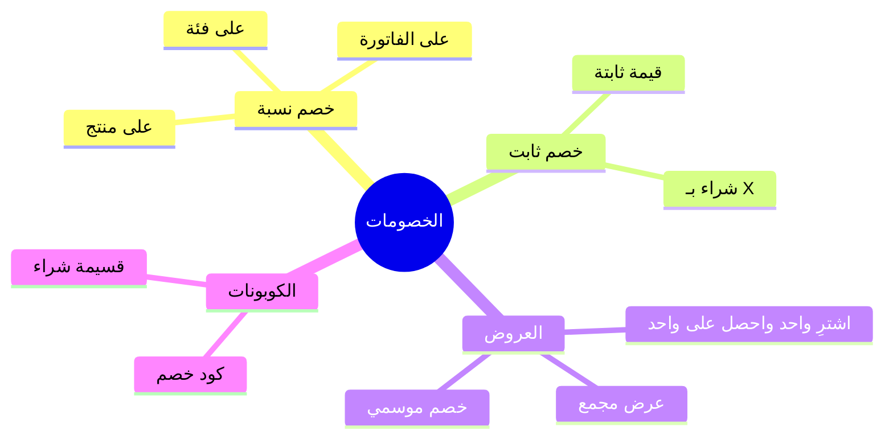
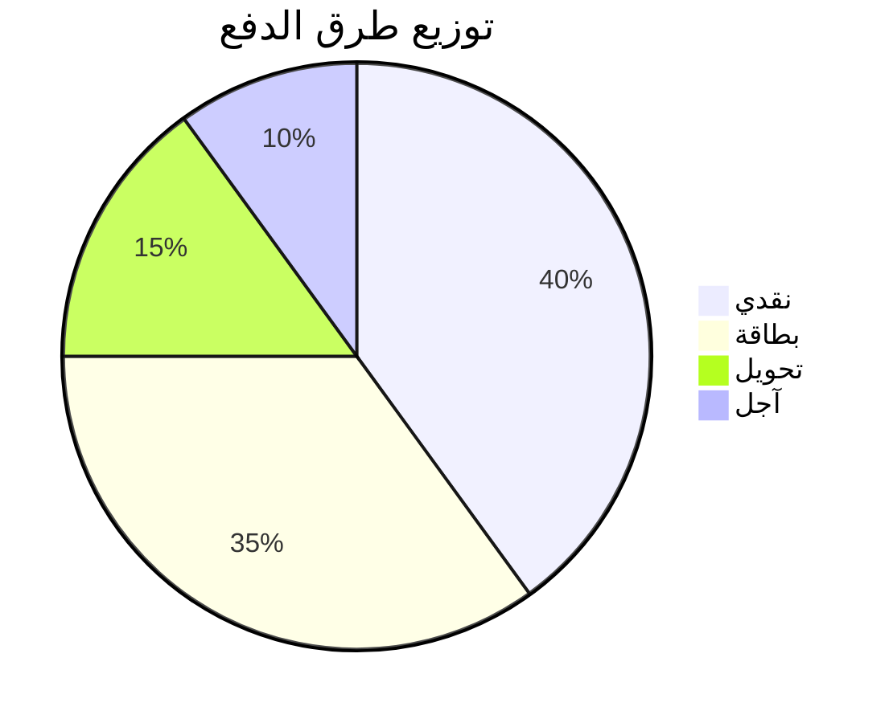

# 🛒 نظام المبيعات

## 🎯 مقدمة

نظام المبيعات هو الواجهة الرئيسية للتفاعل مع العملاء، يوفر نقاط بيع سريعة وفعالة مع إدارة شاملة للفواتير والمرتجعات.

---

## 🏛️ هيكل النظام



---

## 💻 واجهة نقاط البيع (POS)

### التصميم

```
┌─────────────────────────────────────────────────────────────────────┐
│  [الشعار]  فرع: الرياض  │  الكاشير: أحمد  │  14:32  │  [❌]      │
├─────────────────────────────────────────────────────────────────────┤
│                                                                     │
│  ┌─────────────────────────────┐  ┌─────────────────────────────┐  │
│  │     شبكة المنتجات           │  │        سلة المشتريات        │  │
│  │  ┌─────┐┌─────┐┌─────┐     │  │  # المنتج        الكمية السعر│  │
│  │  │ 🍎  ││ 🥛  ││ 🍞  │     │  │  ───────────────────────────│  │
│  │  │تفاح ││حليب ││خبز  │     │  │  1 تفاح أحمر      2    20.00│  │
│  │  │10ريال││8ريال││5ريال│    │  │  2 حليب كامل      1     8.00│  │
│  │  └─────┘└─────┘└─────┘     │  │  3 خبز فرنسي      3    15.00│  │
│  │                             │  │                             │  │
│  │  ┌─────┐┌─────┐┌─────┐     │  │  المجموع:              43.00│  │
│  │  │ 🧀  ││ 🍫  ││ 🥤  │     │  │  الخصم:               -3.00│  │
│  │  │جبن  ││شوكول││عصير│     │  │  الضريبة (15%):        6.00│  │
│  │  │15ريال││12ريال││6ريال│   │  │  ═══════════════════════════│  │
│  │  └─────┘└─────┘└─────┘     │  │  الإجمالي:            46.00│  │
│  │                             │  │                             │  │
│  │  [فواكه][ألبان][مخبوزات]   │  │  [🎁 خصم] [🗑️ إفراغ]       │  │
│  └─────────────────────────────┘  └─────────────────────────────┘  │
│                                                                     │
│  ┌─────────────────────────────────────────────────────────────┐   │
│  │  [💰 نقدي]  [💳 بطاقة]  [🏦 تحويل]  [🔄 آجل]              │   │
│  │                                                             │   │
│  │           [✅ إتمام البيع - 46.00 ريال]                    │   │
│  └─────────────────────────────────────────────────────────────┘   │
└─────────────────────────────────────────────────────────────────────┘
```

### سير عملية البيع



---

## 📄 الفواتير

### هيكل الفاتورة

```
┌─────────────────────────────────────────────────────────────────┐
│                    فاتورة ضريبية مبسطة                         │
│                    شركة السوبر ماركت                            │
├─────────────────────────────────────────────────────────────────┤
│ رقم الفاتورة: INV-2026-0001        التاريخ: 07/03/2026 14:32   │
│ الكاشير: أحمد                      الفرع: الرياض                │
├─────────────────────────────────────────────────────────────────┤
│ #  المنتج              الكمية    السعر    الخصم    الإجمالي    │
├─────────────────────────────────────────────────────────────────┤
│ 1  تفاح أحمر             2       10.00     0.00      20.00      │
│ 2  حليب كامل             1        8.00     0.00       8.00      │
│ 3  خبز فرنسي             3        5.00     0.00      15.00      │
├─────────────────────────────────────────────────────────────────┤
│ المجموع الفرعي:                              43.00              │
│ الخصم:                                        3.00              │
│ الضريبة (15%):                                6.00              │
│ ═══════════════════════════════════════════════════════════════ │
│ الإجمالي:                                    46.00              │
│ المدفوع:                                     50.00              │
│ الباقي:                                       4.00              │
├─────────────────────────────────────────────────────────────────┤
│ طريقة الدفع: نقدي                                               │
│ الرقم الضريبي: 300123456700003                                  │
│                                                                 │
│ شكراً لتسوقكم معنا!                                             │
└─────────────────────────────────────────────────────────────────┘
```

### حالات الفاتورة



---

## 🔄 المرتجعات

### أنواع المرتجعات

| النوع | الوصف | الإجراء |
|-------|-------|---------|
| **مرتجع كامل** | إرجاع الفاتورة بالكامل | إلغاء الفاتورة + إرجاع للمخزون |
| **مرتجع جزئي** | إرجاع بعض البنود | تعديل الفاتورة + إرجاع للمخزون |
| **مرتجع تالف** | منتج تالف | إرجاع للمخزون التالف |

### سير المرتجع



---

## 🎁 العروض والخصومات

### أنواع الخصومات



### جدول العروض

| العرض | النوع | الشروط | الخصم |
|-------|-------|--------|-------|
| عرض الترحيب | نسبة | أول عملية شراء | 10% |
| خصم الموسم | نسبة | مشتريات > 500 | 15% |
| اشترِ 2 احصل على 1 | عرض | منتجات محددة | منتج مجاني |
| كود SAVE20 | كوبون | كود صالح | 20 ريال |

---

## 💳 طرق الدفع

### الدعم



| الطريقة | الوصف | التكامل |
|---------|-------|---------|
| **نقدي** | دفع نقدي مباشر | - |
| **بطاقة** | مدى، Visa، Mastercard | بوابة دفع |
| **تحويل** | تحويل بنكي | تكامل بنكي |
| **آجل** | دفع لاحق | حد ائتمان |

---

## 📊 التقارير

### تقارير المبيعات

| التقرير | الوصف | التكرار |
|---------|-------|---------|
| مبيعات يومية | ملخص المبيعات اليوم | يومي |
| مبيعات شهري | تفصيلي باليوم | شهري |
| أفضل المنتجات | ترتيب المنتجات | شهري |
| أداء الكاشير | مبيعات كل كاشير | أسبوعي |

---

**الوثيقة:** نظام المبيعات  
**الإصدار:** 1.0  
**تاريخ التحديث:** 2026-03-07
