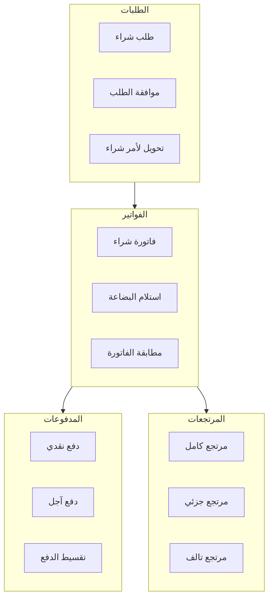
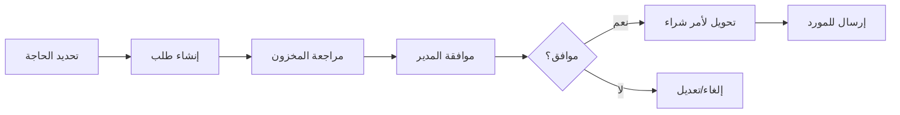
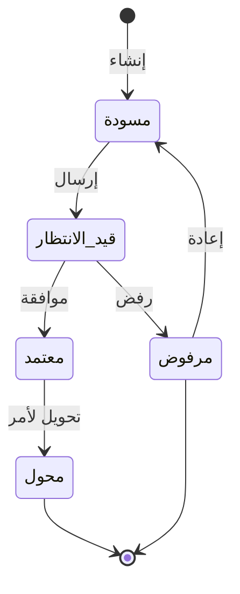
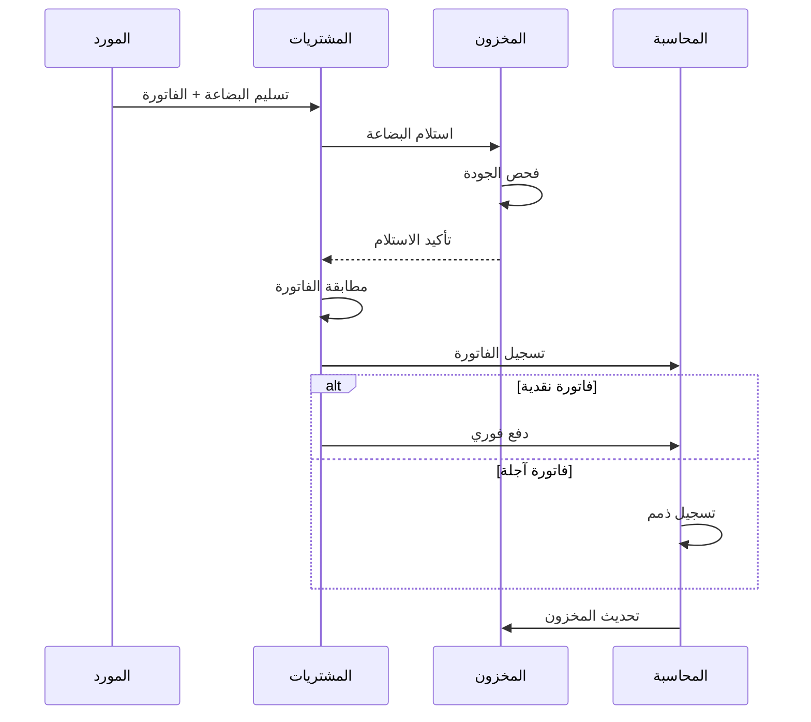
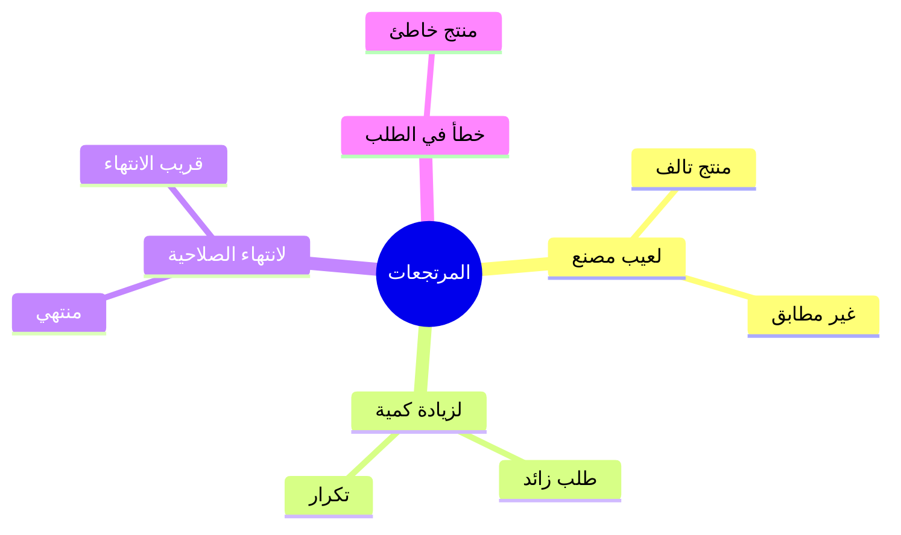

# 📦 نظام المشتريات

## 🎯 مقدمة

نظام المشتريات يدير كامل دورة الشراء من طلبات الشراء إلى فواتير الموردين والمدفوعات، مع إدارة شاملة للموردين وتقييم أدائهم.

---

## 🏛️ هيكل النظام



---

## 📋 طلبات الشراء

### سير العمل



### حالات طلب الشراء



### نموذج طلب شراء

```
┌─────────────────────────────────────────────────────────────────┐
│                    طلب شراء                                     │
├─────────────────────────────────────────────────────────────────┤
│ رقم الطلب: PO-2026-0001          التاريخ: 07/03/2026           │
│ المطلوب من: أمين المخزن          الأولوية: عالية                │
├─────────────────────────────────────────────────────────────────┤
│ #  المنتج              الكمية    الوحدة    ملاحظات              │
├─────────────────────────────────────────────────────────────────┤
│ 1  تفاح أحمر             50      كجم      عاجل                 │
│ 2  حليب كامل            100      علبة                           │
│ 3  خبز فرنسي            200      ربطة     يومياً               │
├─────────────────────────────────────────────────────────────────┤
│ المورد المقترح: شركة الخليج للمواد الغذائية                     │
│ تاريخ التسليم المطلوب: 10/03/2026                               │
├─────────────────────────────────────────────────────────────────┤
│ سير الموافقة:                                                   │
│ [✓] أمين المخزن    [✓] مدير المشتريات    [⏳] المدير المالي    │
└─────────────────────────────────────────────────────────────────┘
```

---

## 📄 فواتير الشراء

### سير العمل



### القيود المحاسبية

#### فاتورة شراء آجلة

```
من حـ المخزون (مدين)                    1,000.00
من حـ ضريبة القيمة المضافة المدخلة (مدين) 150.00
    إلى حـ ذمم الموردين (دائن)                    1,150.00
```

#### دفع للمورد

```
من حـ ذمم الموردين (مدين)               1,150.00
    إلى حـ البنك/الصندوق (دائن)                   1,150.00
```

---

## 🔄 المرتجعات للموردين

### أنواع المرتجعات



### سير المرتجع


---

## 🏭 إدارة الموردين

### بطاقة المورد

```
┌─────────────────────────────────────────────────────────────────┐
│                    بطاقة المورد                                 │
├─────────────────────────────────────────────────────────────────┤
│ رقم المورد: SUP-00001                                           │
│ اسم المورد: شركة الخليج للمواد الغذائية                         │
│ النوع: شركة                    التصنيف: رئيسي                   │
│ الحالة: نشط                                                   │
├─────────────────────────────────────────────────────────────────┤
│ بيانات الاتصال:                                                 │
│   العنوان: الرياض، حي الورود، شارع الملك فهد                   │
│   الهاتف: 011-1234567                                           │
│   الجوال: 050-1234567                                           │
│   البريد: info@alkhaleej.com                                    │
├─────────────────────────────────────────────────────────────────┤
│ البيانات المالية:                                               │
│   الرقم الضريبي: 300123456700003                               │
│   حد الائتمان: 50,000 ريال                                      │
│   شروط الدفع: 30 يوم                                            │
│   الرصيد الحالي: 15,000 ريال                                    │
├─────────────────────────────────────────────────────────────────┤
│ التقييم: ⭐⭐⭐⭐⭐ (4.5/5)                                        │
│ المنتجات الرئيسية: فواكه، خضروات، ألبان                         │
└─────────────────────────────────────────────────────────────────┘
```

### تقييم الموردين

| المعيار | الوزن | المؤشرات |
|---------|-------|----------|
| جودة المنتجات | 30% | نسبة المرتجعات، شكاوى العملاء |
| الالتزام بالمواعيد | 25% | نسبة التسليم في الوقت |
| الأسعار | 20% | تنافسية الأسعار |
| خدمة العملاء | 15% | سرعة الاستجابة |
| المرونة | 10% | قبول المرتجعات |

---

## 💳 متابعة المدفوعات

### تقرير مستحقات الموردين

```
┌─────────────────────────────────────────────────────────────────┐
│                    مستحقات الموردين                             │
│                    تاريخ التقرير: 31/01/2026                    │
├──────────────────┬──────────┬──────────┬──────────┬─────────────┤
│ المورد           │ الرصيد   │ مستحق    │ مستحق    │ إجمالي      │
│                  │          │ الآن      │ لاحقاً   │             │
├──────────────────┼──────────┼──────────┼──────────┼─────────────┤
│ شركة الخليج      │ 15,000   │ 10,000   │ 5,000    │ 15,000      │
│ مزرعة النور      │ 8,500    │ 5,000    │ 3,500    │ 8,500       │
│ مصنع الوفاء      │ 22,000   │ 12,000   │ 10,000   │ 22,000      │
├──────────────────┼──────────┼──────────┼──────────┼─────────────┤
│ الإجمالي         │ 45,500   │ 27,000   │ 18,500   │ 45,500      │
└──────────────────┴──────────┴──────────┴──────────┴─────────────┘
```

---

**الوثيقة:** نظام المشتريات  
**الإصدار:** 1.0  
**تاريخ التحديث:** 2026-03-07
