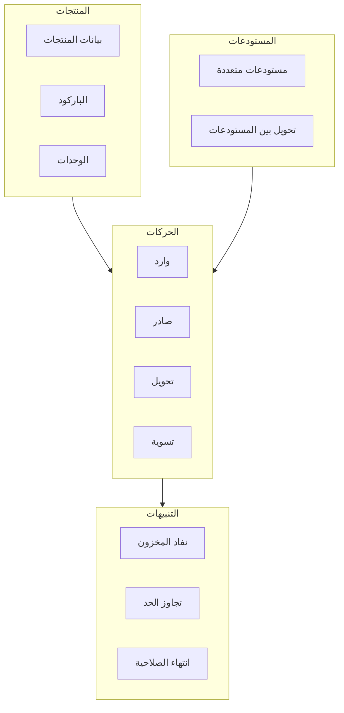
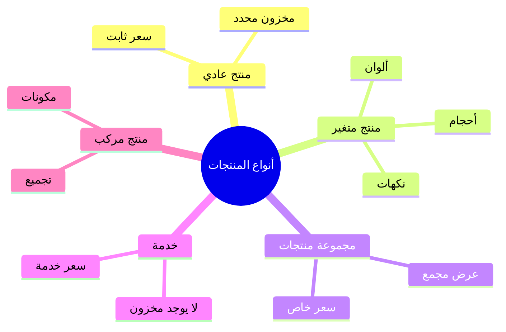
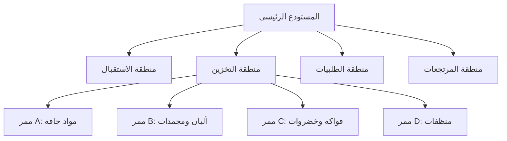
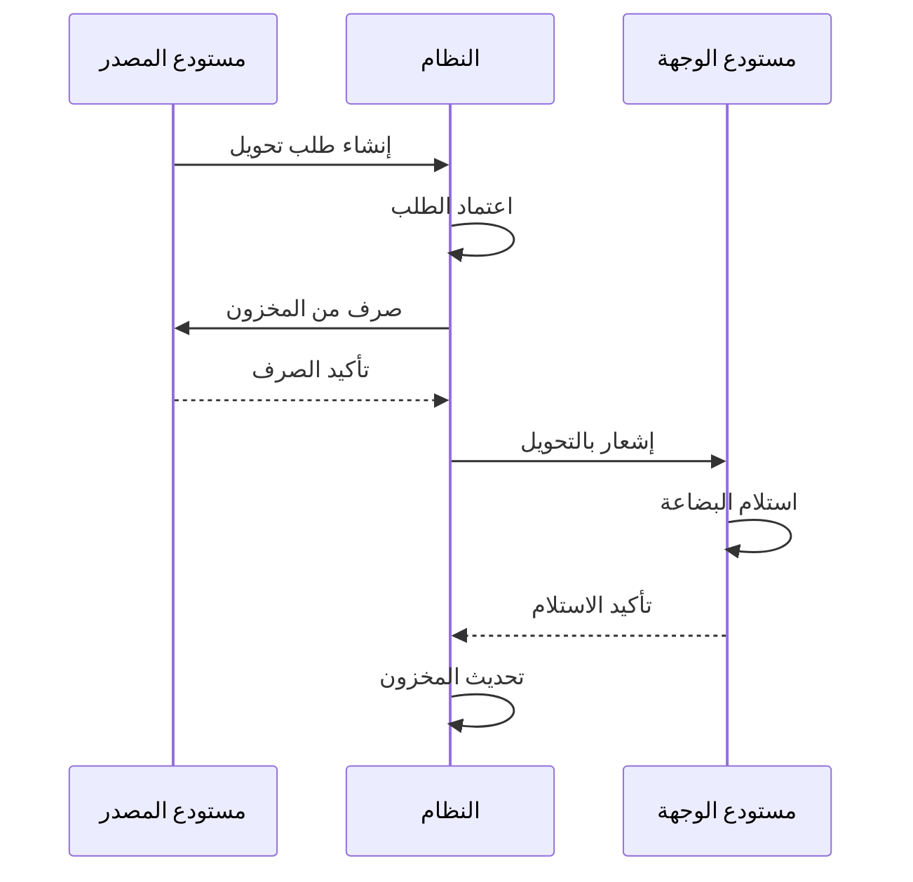
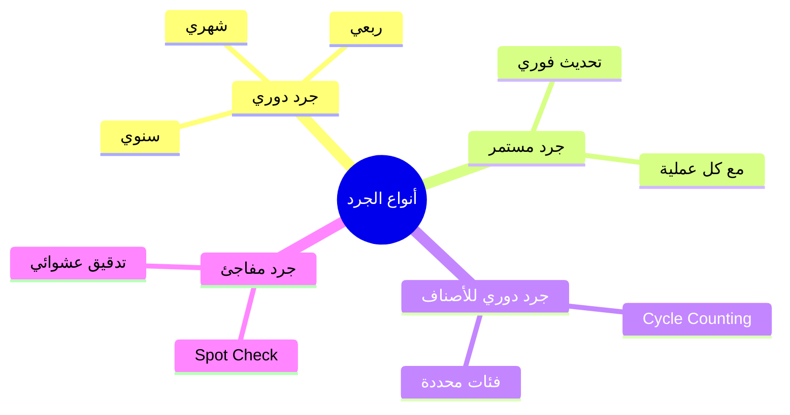

# 📋 نظام المخزون

## 🎯 مقدمة

نظام المخزون يوفر إدارة شاملة للمنتجات والمستودعات مع تتبع فوري لجميع الحركات ونظام جرد متكامل.

---

## 🏛️ هيكل النظام



---

## 📦 إدارة المنتجات

### بطاقة المنتج

```
┌─────────────────────────────────────────────────────────────────┐
│                    بطاقة المنتج                                 │
├─────────────────────────────────────────────────────────────────┤
│ SKU: PRD-001                                                    │
│ الاسم (AR): تفاح أحمر                                           │
│ الاسم (EN): Red Apple                                           │
│ الفئة: فواكه طازجة                                              │
│ النوع: منتج عادي                                                │
│ الحالة: نشط                                                     │
├─────────────────────────────────────────────────────────────────┤
│ الباركود:                                                       │
│   الرئيسي: 1234567890123                                        │
│   الداخلي: 000001                                               │
├─────────────────────────────────────────────────────────────────┤
│ التسعير:                                                        │
│   سعر التكلفة: 4.00 ريال                                        │
│   سعر البيع: 5.50 ريال                                          │
│   سعر الجملة: 5.00 ريال                                         │
│   هامش الربح: 27%                                               │
├─────────────────────────────────────────────────────────────────┤
│ المخزون:                                                        │
│   الوحدة الأساسية: كجم                                          │
│   الكمية الحالية: 250 كجم                                       │
│   حد إعادة الطلب: 50 كجم                                        │
│   الكمية القصوى: 500 كجم                                        │
│   موقع التخزين: ممر C - رف 3                                    │
├─────────────────────────────────────────────────────────────────┤
│ المورد الافتراضي: شركة الخليج                                   │
│ الضريبة: 15%                                                    │
└─────────────────────────────────────────────────────────────────┘
```

### أنواع المنتجات



---

## 🏭 المستودعات

### هيكل المستودعات



### تحويل بين المستودعات



---

## 📊 حركات المخزون

### أنواع الحركات

| النوع | الاتجاه | الوصف | مثال |
|-------|---------|-------|------|
| **وارد** | + | زيادة المخزون | شراء، مرتجع عميل |
| **صادر** | - | نقصان المخزون | بيع، مرتجع مورد |
| **تحويل** | ± | نقل بين مستودعات | من مستودع لآخر |
| **تسوية** | ± | تصحيح الفروقات | جرد، تلف |

### بطاقة صنف

```
┌─────────────────────────────────────────────────────────────────┐
│                    بطاقة صنف                                    │
│ المنتج: تفاح أحمر (SKU: PRD-001)                                │
│ المستودع: الرئيسي - الرياض                                      │
├──────────┬────────────┬────────┬────────┬────────┬────────────┤
│ التاريخ  │ العملية    │ وارد   │ صادر   │ الرصيد │ المرجع     │
├──────────┼────────────┼────────┼────────┼────────┼────────────┤
│ 01/01    │ رصيد افتتاح│ 100    │ -      │ 100    │ -          │
│ 05/01    │ شراء       │ 200    │ -      │ 300    │ PO-001     │
│ 07/01    │ بيع        │ -      │ 50     │ 250    │ INV-101    │
│ 10/01    │ بيع        │ -      │ 30     │ 220    │ INV-102    │
│ 12/01    │ مرتجع      │ 5      │ -      │ 225    │ RET-001    │
│ 15/01    │ تالف       │ -      │ 10     │ 215    │ DMG-001    │
│ 20/01    │ شراء       │ 100    │ -      │ 315    │ PO-002     │
├──────────┼────────────┼────────┼────────┼────────┼────────────┤
│          │ الإجمالي   │ 405    │ 90     │ 315    │            │
└──────────┴────────────┴────────┴────────┴────────┴────────────┘

متوسط التكلفة: 4.50 ريال/كجم
قيمة المخزون: 1,417.50 ريال
```

---

## 🔍 نظام الجرد

### أنواع الجرد



### سير عملية الجرد


---

## 🔔 نظام التنبيهات

### أنواع التنبيهات

| التنبيه | الشرط | الإجراء |
|---------|-------|---------|
| 🔴 نفاد المخزون | المخزون = 0 | إيقاف البيع + تنبيه |
| 🟠 حد إعادة الطلب | المخزون ≤ الحد | تنبيه المشتريات |
| 🟡 تجاوز المخزون | المخزون > الحد الأقصى | تنبيه للتخفيضات |
| 🔵 انتهاء الصلاحية | قبل انتهاء بـ X يوم | تنبيه للعرض |
| ⚫ ركود المخزون | بدون حركة لـ X يوم | اقتراح عروض |

### حساب حد إعادة الطلب

```
حد إعادة الطلب = (متوسط الاستهلاك اليومي × فترة التوريد) + مخزون الأمان

مثال:
- متوسط المبيعات اليومية: 20 كجم
- فترة التوريد: 3 أيام
- مخزون الأمان: 20 كجم

حد إعادة الطلب = (20 × 3) + 20 = 80 كجم
```

---

## 📊 طرق تقييم المخزون

| الطريقة | الوصف | الاستخدام |
|---------|-------|-----------|
| **FIFO** | الأول داخل أول خارج | المنتجات ذات الصلاحية |
| **LIFO** | الأخير داخل أول خارج | المنتجات غير الغذائية |
| **المتوسط المرجح** | متوسط التكلفة المتحرك | المنتجات المتشابهة |
| **التكلفة المعيارية** | تكلفة محددة مسبقاً | التصنيع |

---

**الوثيقة:** نظام المخزون  
**الإصدار:** 1.0  
**تاريخ التحديث:** 2026-03-07
