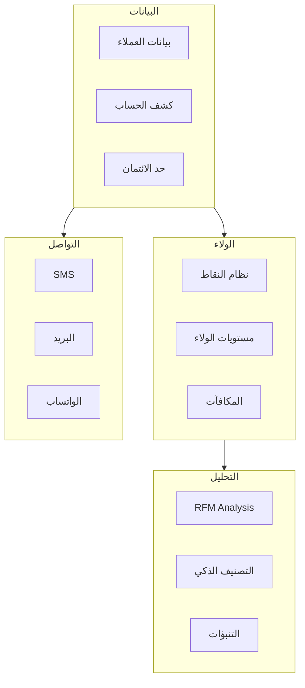
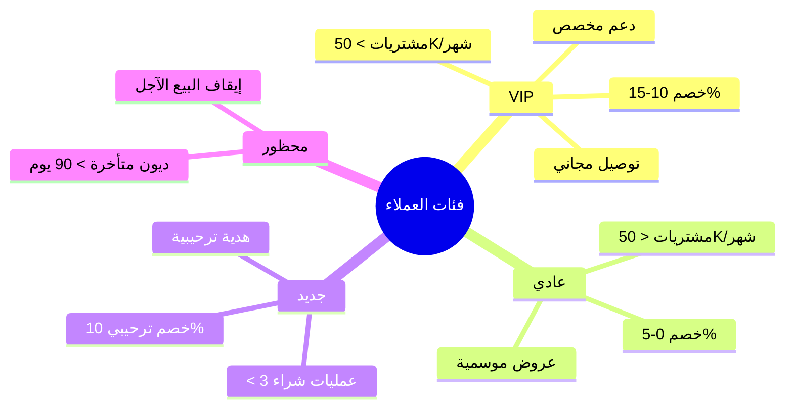
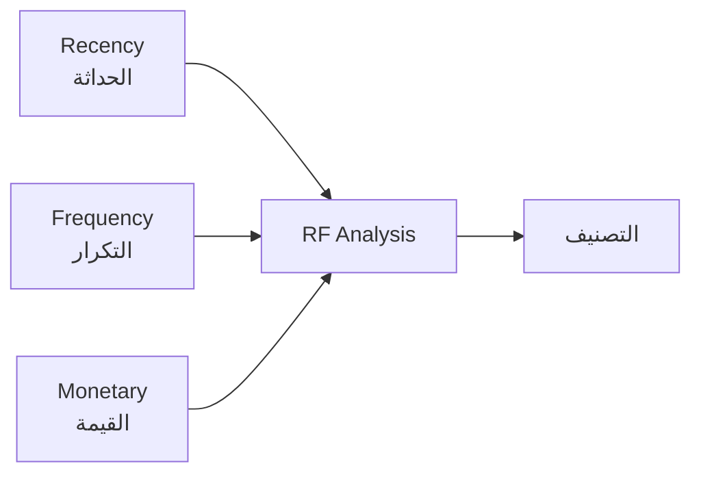

# 👥 نظام العملاء

## 🎯 مقدمة

نظام العملاء يوفر إدارة شاملة لعلاقات العملاء مع نظام نقاط وولاء متكامل وتحليل سلوكي متقدم.

---

## 🏛️ هيكل النظام



---

## 📝 بطاقة العميل

```
┌─────────────────────────────────────────────────────────────────┐
│                    بطاقة العميل                                 │
├─────────────────────────────────────────────────────────────────┤
│ رقم العميل: CUS-00123                                           │
│ الاسم: أحمد محمد عبدالله                                        │
│ النوع: فرد                                                    │
│ الفئة: VIP ⭐⭐⭐⭐⭐                                             │
├─────────────────────────────────────────────────────────────────┤
│ بيانات الاتصال:                                                 │
│   الهاتف: 050-1234567                                           │
│   البريد: ahmed@email.com                                       │
│   العنوان: الرياض، حي النزهة                                    │
├─────────────────────────────────────────────────────────────────┤
│ البيانات المالية:                                               │
│   حد الائتمان: 10,000 ريال                                      │
│   الرصيد الحالي: 3,020 ريال                                     │
│   شروط الدفع: 30 يوم                                            │
│   نسبة الخصم: 10%                                               │
├─────────────────────────────────────────────────────────────────┤
│ نظام الولاء:                                                    │
│   النقاط: 2,500 نقطة                                            │
│   المستوى: ذهبي                                                 │
│   إجمالي المشتريات: 45,000 ريال                                 │
├─────────────────────────────────────────────────────────────────┤
│ آخر عملية: فاتورة #1234 - 2,500 ريال - 05/03/2026             │
└─────────────────────────────────────────────────────────────────┘
```

---

## 🏆 فئات العملاء

### التصنيف



### جدول الفئات

| الفئة | المعيار | الخصم | المميزات |
|-------|---------|-------|----------|
| 🌟 VIP | > 50,000 ريال/شهر | 10-15% | أولوية، توصيل مجاني، دعم مخصص |
| 👤 عادي | < 50,000 ريال/شهر | 0-5% | عروض موسمية، نظام النقاط |
| 🆕 جديد | < 3 عمليات شراء | 10% | خصم ترحيبي، هدية |
| ⛔ محظور | ديون > 90 يوم | - | إيقاف البيع الآجل |

---

## 💎 نظام النقاط والولاء

### جمع النقاط

| العملية | النقاط | ملاحظات |
|---------|--------|---------|
| كل 1 ريال شراء | 1 نقطة | أساسي |
| فئة الألبان | 2 نقطة | عرض خاص |
| مشتريات > 500 ريال | نقاط مضاعفة | حافز |

### صرف النقاط

```
100 نقطة = 5 ريال خصم
أو
استبدال بهدايا عينية
أو
قسائم شراء
```

### مستويات الولاء

| المستوى | النقاط | الخصم | المميزات |
|---------|--------|-------|----------|
| برونزي | 0-999 | 2% | - |
| فضي | 1,000-4,999 | 5% | توصيل مجاني |
| ذهبي | 5,000-9,999 | 8% | أولوية الطلبات |
| بلاتيني | 10,000+ | 12% | دعم VIP |

---

## 📊 تحليل RFM

### المؤشرات



### التصنيف

| الفئة | R | F | M | الإجراء |
|-------|---|---|---|---------|
| **Champions** | عالي | عالي | عالي | الحفاظ والمكافأة |
| **Loyal** | عالي | عالي | متوسط | برامج ولاء |
| **Potential** | عالي | متوسط | - | تشجيع على الزيادة |
| **At Risk** | منخفض | عالي سابقاً | - | إعادة تنشيط |
| **Lost** | منخفض | منخفض | - | حملات استعادة |

---

## 💳 كشف حساب العميل

```
┌─────────────────────────────────────────────────────────────────┐
│                    كشف حساب العميل                              │
│ العميل: أحمد محمد (CUS-00123)                                   │
│ الفترة: 01/01/2026 - 31/01/2026                                 │
├──────────┬────────────┬────────────┬────────┬────────┬─────────┤
│ التاريخ  │ الوثيقة    │ البيان     │ مدين   │ دائن   │ الرصيد  │
├──────────┼────────────┼────────────┼────────┼────────┼─────────┤
│ 01/01    │ -          │ رصيد سابق  │ -      │ -      │ 2,500   │
│ 05/01    │ INV-101    │ فاتورة بيع │ 1,150  │ -      │ 3,650   │
│ 10/01    │ REC-001    │ سند قبض    │ -      │ 3,000  │ 650     │
│ 15/01    │ INV-102    │ فاتورة بيع │ 2,300  │ -      │ 2,950   │
│ 20/01    │ REC-002    │ سند قبض    │ -      │ 2,000  │ 950     │
│ 25/01    │ INV-103    │ فاتورة بيع │ 1,725  │ -      │ 2,675   │
├──────────┼────────────┼────────────┼────────┼────────┼─────────┤
│          │            │ الإجمالي   │ 5,175  │ 5,000  │         │
│          │            │ الرصيد الحالي              │ 2,675   │
└──────────┴────────────┴────────────┴────────┴────────┴─────────┘

حد الائتمان: 10,000 ريال    المتاح: 7,325 ريال
```

---

## 📈 تقرير أعمار الديون

```
┌─────────────────────────────────────────────────────────────────┐
│                    أعمار الديون                                 │
│ تاريخ التقرير: 31/01/2026                                       │
├────────────┬─────────┬─────────┬─────────┬─────────┬──────────┤
│ العميل     │ حالي    │ 1-30    │ 31-60   │ 61-90   │ >90      │
│            │ (0)     │ يوم     │ يوم     │ يوم     │ يوم      │
├────────────┼─────────┼─────────┼─────────┼─────────┼──────────┤
│ أحمد محمد  │ 1,500   │ 2,000   │ 500     │ -       │ -        │
│ خالد عبدالله│ 800    │ 1,200   │ 1,500   │ 700     │ -        │
│ سعيد علي   │ 3,000   │ 500     │ -       │ -       │ 2,000    │
├────────────┼─────────┼─────────┼─────────┼─────────┼──────────┤
│ الإجمالي   │ 5,300   │ 3,700   │ 2,000   │ 700     │ 2,000    │
│ النسبة     │ 39%     │ 27%     │ 15%     │ 5%      │ 14%      │
└────────────┴─────────┴─────────┴─────────┴─────────┴──────────┘

⚠️ ديون متأخرة (>30 يوم): 8,400 ريال (61%)
🔴 ديون خطرة (>90 يوم): 2,000 ريال (14%)
```

---

**الوثيقة:** نظام العملاء  
**الإصدار:** 1.0  
**تاريخ التحديث:** 2026-03-07
