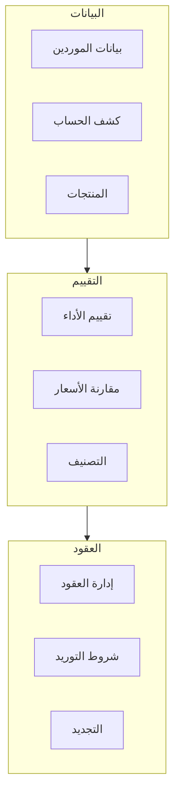
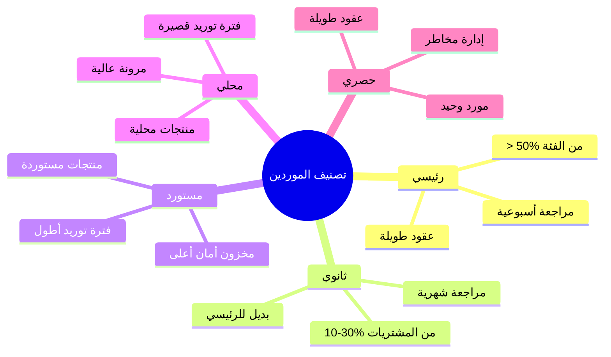

# 🏭 نظام الموردين

## 🎯 مقدمة

نظام الموردين يوفر إدارة شاملة للعلاقات مع الموردين مع تقييم الأداء ومقارنة الأسعار وإدارة العقود.

---

## 🏛️ هيكل النظام



---

## 📝 بطاقة المورد

```
┌─────────────────────────────────────────────────────────────────┐
│                    بطاقة المورد                                 │
├─────────────────────────────────────────────────────────────────┤
│ رقم المورد: SUP-00123                                           │
│ اسم المورد: شركة الخليج للمواد الغذائية                         │
│ النوع: شركة                    التصنيف: رئيسي                   │
│ الحالة: نشط                                                   │
├─────────────────────────────────────────────────────────────────┤
│ بيانات الاتصال:                                                 │
│   العنوان: الرياض، حي الورود، شارع الملك فهد                   │
│   المدينة: الرياض                                               │
│   الهاتف: 011-1234567                                           │
│   الجوال: 050-1234567                                           │
│   البريد: info@alkhaleej.com                                    │
│   الموقع: www.alkhaleej.com                                     │
├─────────────────────────────────────────────────────────────────┤
│ جهات الاتصال:                                                   │
│   المسؤول: محمد العلي - مدير المبيعات                           │
│   المحاسب: أحمد السالم                                          │
│   مندوب المبيعات: خالد الفهد                                    │
├─────────────────────────────────────────────────────────────────┤
│ البيانات المالية:                                               │
│   الرقم الضريبي: 300123456700003                               │
│   السجل التجاري: 1010123456                                     │
│   حد الائتمان: 50,000 ريال                                      │
│   شروط الدفع: 30 يوم                                            │
│   العملة: ريال سعودي                                            │
├─────────────────────────────────────────────────────────────────┤
│ معلومات إضافية:                                                 │
│   فترة التوريد: 3 أيام                                          │
│   الحد الأدنى للطلب: 1,000 ريال                                 │
│   نسبة الخصم: 5%                                                │
│   التقييم: ⭐⭐⭐⭐⭐ (4.5/5)                                      │
├─────────────────────────────────────────────────────────────────┤
│ المنتجات الرئيسية: فواكه، خضروات، ألبان                         │
│ المرفقات: عقد رئيسي، شهادة ضمان، كتالوج                         │
└─────────────────────────────────────────────────────────────────┘
```

---

## 🏆 تصنيف الموردين



### جدول التصنيف

| التصنيف | المعيار | الإدارة |
|---------|---------|---------|
| 🏆 رئيسي | > 30% من المشتريات | مراجعة أسبوعية، عقود طويلة |
| 🥈 ثانوي | 10-30% من المشتريات | مراجعة شهرية |
| 🌐 مستورد | منتجات مستوردة | تخطيط مسبق، مخزون أمان أعلى |
| 🏪 محلي | منتجات محلية | طلبيات متكررة |
| ⭐ حصري | مورد وحيد | عقود طويلة، إدارة مخاطر |

---

## 📊 تقييم الموردين

### معايير التقييم

| المعيار | الوزن | مؤشرات القياس |
|---------|-------|---------------|
| جودة المنتجات | 30% | نسبة المرتجعات، شكاوى العملاء |
| الالتزام بالمواعيد | 25% | نسبة التسليم في الوقت |
| الأسعار | 20% | تنافسية الأسعار |
| خدمة العملاء | 15% | سرعة الاستجابة |
| المرونة | 10% | قبول المرتجعات |

### مستويات التقييم

| التقييم | النقاط | الإجراء |
|---------|--------|---------|
| ممتاز | 90-100 | تفضيل + زيادة الحصة |
| جيد جداً | 80-89 | الحفاظ + تطوير العلاقة |
| جيد | 70-79 | مراقبة + تحسين مطلوب |
| مقبول | 60-69 | تحذير + خطة تحسين |
| ضعيف | < 60 | مراجعة + استبداد محتمل |

### تقرير التقييم

```
┌─────────────────────────────────────────────────────────────────┐
│                    تقرير تقييم الموردين                         │
│ الفترة: الربع الأول 2026                                        │
├────────────────┬────────┬────────┬────────┬────────┬──────────┤
│ المورد         │ الجودة │ المواعيد│ الأسعار│ الخدمة │ المجموع │
├────────────────┼────────┼────────┼────────┼────────┼──────────┤
│ شركة الخليج    │ 28/30  │ 23/25  │ 18/20  │ 13/15  │ 91/100  │
│ مزرعة النور    │ 27/30  │ 24/25  │ 17/20  │ 14/15  │ 90/100  │
│ مصنع الوفاء    │ 25/30  │ 20/25  │ 16/20  │ 12/15  │ 80/100  │
│ مورد التوفيق   │ 22/30  │ 18/25  │ 15/20  │ 10/15  │ 71/100  │
└────────────────┴────────┴────────┴────────┴────────┴──────────┘
```

---

## 💰 مقارنة الأسعار

```
┌─────────────────────────────────────────────────────────────────┐
│                    مقارنة أسعار الموردين                        │
│ المنتج: تفاح أحمر فاخر (SKU: FRU-001)                           │
│ الكمية المطلوبة: 500 كجم                                        │
├────────────────┬──────────┬──────────┬──────────┬───────────────┤
│ المورد         │ السعر    │ الخصم    │ الإجمالي │ ملاحظات       │
│                │ (لكجم)   │          │          │               │
├────────────────┼──────────┼──────────┼──────────┼───────────────┤
│ شركة الخليج    │ 5.00     │ 5%       │ 2,375    │ توصيل مجاني   │
│ مزرعة النور    │ 4.80     │ 3%       │ 2,328    │ جودة ممتازة   │
│ مصنع الوفاء    │ 4.50     │ 0%       │ 2,250    │ فترة توريد 3 أيام│
│ مورد التوفيق   │ 4.30     │ 0%       │ 2,150    │ جودة متوسطة   │
└────────────────┴──────────┴──────────┴──────────┴───────────────┘

✅ التوصية: مزرعة النور (أفضل توازن بين السعر والجودة)
```

---

## 📄 كشف حساب المورد

```
┌─────────────────────────────────────────────────────────────────┐
│                    كشف حساب المورد                              │
│ المورد: شركة الخليج للمواد الغذائية (SUP-00123)                 │
│ الفترة: 01/01/2026 - 31/01/2026                                 │
├──────────┬────────────┬────────────┬────────┬────────┬─────────┤
│ التاريخ  │ الوثيقة    │ البيان     │ مدين   │ دائن   │ الرصيد  │
├──────────┼────────────┼────────────┼────────┼────────┼─────────┤
│ 01/01    │ -          │ رصيد سابق  │ -      │ -      │ 5,000   │
│ 03/01    │ PINV-001   │ فاتورة شراء│ -      │ 12,000 │ 17,000  │
│ 10/01    │ PMT-001    │ دفعة نقدية │ 10,000 │ -      │ 7,000   │
│ 15/01    │ PINV-002   │ فاتورة شراء│ -      │ 8,500  │ 15,500  │
│ 25/01    │ PMT-002    │ دفعة نقدية │ 8,000  │ -      │ 7,500   │
├──────────┼────────────┼────────────┼────────┼────────┼─────────┤
│          │            │ الإجمالي   │ 18,000 │ 20,500 │         │
│          │            │ الرصيد الحالي              │ 7,500   │
└──────────┴────────────┴────────────┴────────┴────────┴─────────┘

حد الائتمان: 50,000 ريال    المتاح: 42,500 ريال
```

---

## 📋 إدارة العقود

### هيكل العقد

```
┌─────────────────────────────────────────────────────────────────┐
│                    عقد مع مورد                                  │
├─────────────────────────────────────────────────────────────────┤
│ رقم العقد: CONT-2026-001                                        │
│ المورد: شركة الخليج للمواد الغذائية                             │
│ تاريخ العقد: 01/01/2026                                         │
│ تاريخ البدء: 01/01/2026                                         │
│ تاريخ الانتهاء: 31/12/2026                                      │
│ نوع العقد: سنوي                                                 │
├─────────────────────────────────────────────────────────────────┤
│ شروط العقد:                                                     │
│   المنتجات المشمولة: فواكه، خضروات، ألبان                       │
│   الأسعار المتفق عليها: جدول أسعار مرفق                         │
│   شروط التسليم: خلال 3 أيام عمل                                │
│   شروط الدفع: 30 يوم من تاريخ الفاتورة                         │
│   الحد الأدنى للطلب: 1,000 ريال                                 │
├─────────────────────────────────────────────────────────────────┤
│ بنود خاصة:                                                      │
│   حصرية: لا                                                     │
│   مراجعة الأسعار: كل 6 أشهر                                     │
│   التجديد: تلقائي إذا لم يتم إخطار قبل 30 يوم                   │
├─────────────────────────────────────────────────────────────────┤
│ نسبة التنفيذ: 65%                                               │
│ تنبيه قبل الانتهاء: 30 يوم                                      │
└─────────────────────────────────────────────────────────────────┘
```

---

**الوثيقة:** نظام الموردين  
**الإصدار:** 1.0  
**تاريخ التحديث:** 2026-03-07
