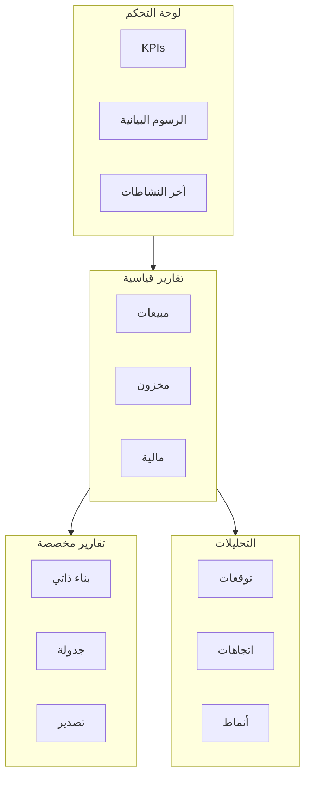
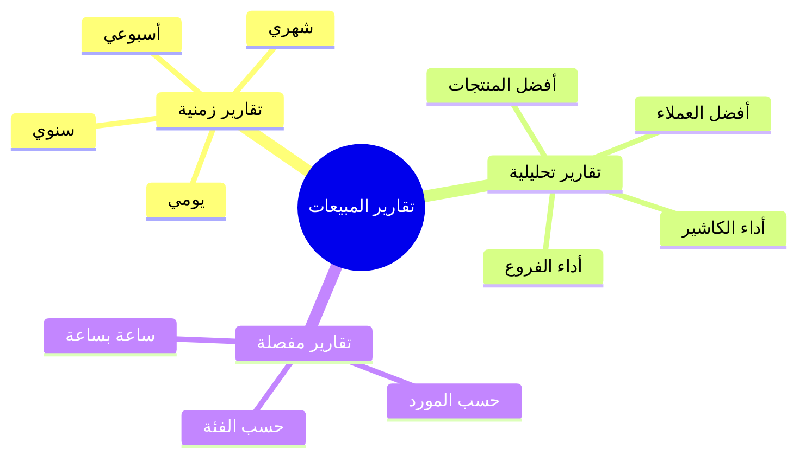
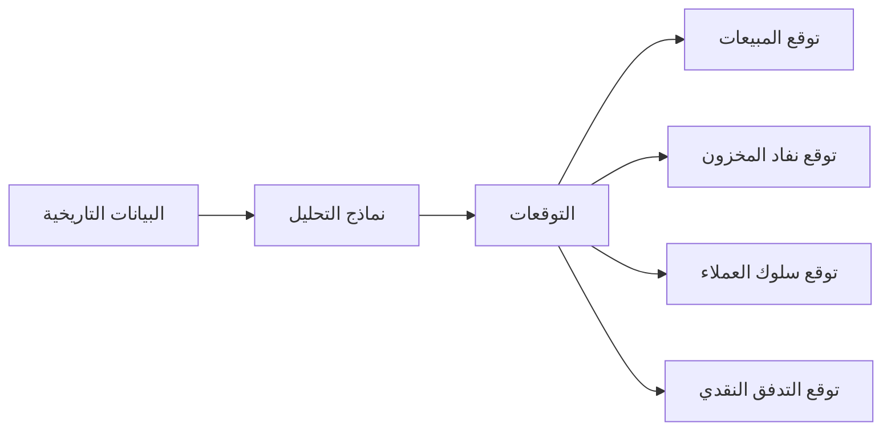

# 📈 نظام التقارير

## 🎯 مقدمة

نظام التقارير يوفر تحليلات شاملة ولوحة تحكم تفاعلية مع تقارير قياسية ومخصصة وتحليلات تنبؤية.

---

## 🏛️ هيكل النظام



---

## 📊 لوحة التحكم

### التصميم

```
┌─────────────────────────────────────────────────────────────────────┐
│                    لوحة التحكم الرئيسية                            │
├─────────────────────────────────────────────────────────────────────┤
│  [اليوم ▼] [الفرع: الكل ▼] [🔄 تحديث] [⚙️]                        │
├─────────────────────────────────────────────────────────────────────┤
│                                                                     │
│  ┌────────────┐ ┌────────────┐ ┌────────────┐ ┌────────────┐       │
│  │    💰     │ │    📊     │ │    🛒     │ │    👥     │       │
│  │  مبيعات   │ │  أرباح   │ │  طلبات   │ │  عملاء  │       │
│  │  اليوم    │ │  اليوم   │ │  اليوم   │ │  جدد    │       │
│  │           │ │          │ │          │ │         │       │
│  │ 15,250    │ │ 3,420    │ │ 45       │ │ 8       │       │
│  │ ريال      │ │ ريال     │ │          │ │         │       │
│  │ ▲ 12%    │ │ ▲ 8%     │ │ ▼ 3%     │ │ ▲ 25%   │       │
│  └────────────┘ └────────────┘ └────────────┘ └────────────┘       │
│                                                                     │
│  ┌───────────────────────────┬───────────────────────────┐         │
│  │   المبيعات هذا الأسبوع    │   توزيع المبيعات حسب الفئة│         │
│  │                           │                           │         │
│  │   ▲                       │        ╭──────╮           │         │
│  │   │    ╱╲    ╱╲          │       ╱  35%  ╲          │         │
│  │   │   ╱  ╲  ╱  ╲         │      │  فواكه  │          │         │
│  │   │  ╱    ╲╱    ╲        │       ╲       ╱          │         │
│  │   │ ╱              ╲     │        ╰──────╯           │         │
│  │   └──────────────────    │     🥛 25%  🍞 20%        │         │
│  │     س م أ خ ج س          │     ألبان   مخبوزات        │         │
│  └───────────────────────────┴───────────────────────────┘         │
│                                                                     │
│  ┌───────────────────────────┬───────────────────────────┐         │
│  │   أفضل المنتجات مبيعاً    │   المنتجات نافدة/منخفضة   │         │
│  │   1. تفاح أحمر - 250 كجم  │   🔴 حليب كامل - مخزون: 5 │         │
│  │   2. حليب طازج - 180 علبة │   🟡 خبز توست - مخزون: 12 │         │
│  │   3. خبز فرنسي - 150 ربطة │                           │         │
│  └───────────────────────────┴───────────────────────────┘         │
│                                                                     │
│  ┌─────────────────────────────────────────────────────────────┐   │
│  │   آخر النشاطات                                              │   │
│  │   • فاتورة جديدة #1234 - 2,500 ريال - منذ 5 دقائق          │   │
│  │   • دفعة مستلمة من العميل أحمد - 1,000 ريال                │   │
│  │   • منتج نافد من المخزون: حليب كامل - 10 علب               │   │
│  └─────────────────────────────────────────────────────────────┘   │
└─────────────────────────────────────────────────────────────────────┘
```

---

## 📈 مؤشرات الأداء الرئيسية (KPIs)

### مؤشرات المبيعات

| المؤشر | الصيغة | الهدف |
|--------|--------|-------|
| إجمالي المبيعات | مجموع قيم الفواتير | نمو 10% شهرياً |
| متوسط قيمة الفاتورة | المبيعات / عدد الفواتير | > 100 ريال |
| معدل النمو | (الشهر الحالي - السابق) / السابق | > 5% |

### مؤشرات الربحية

| المؤشر | الصيغة | الهدف |
|--------|--------|-------|
| هامش الربح الإجمالي | (المبيعات - التكلفة) / المبيعات | > 25% |
| هامش الربح الصافي | صافي الربح / المبيعات | > 10% |
| العائد على الأصول | صافي الربح / إجمالي الأصول | > 15% |

### مؤشرات المخزون

| المؤشر | الصيغة | الهدف |
|--------|--------|-------|
| معدل دوران المخزون | تكلفة البضاعة / متوسط المخزون | > 6 سنوياً |
| أيام المخزون | متوسط المخزون / (تكلفة البضاعة/365) | < 30 يوم |
| نسبة النفاد | منتجات نافدة / إجمالي المنتجات | < 2% |

---

## 📋 التقارير القياسية

### تقارير المبيعات



### تقارير المخزون

| التقرير | الوصف | التكرار |
|---------|-------|---------|
| حركة المخزون | جميع الحركات لفترة | يومي |
| قيمة المخزون | قيمة المخزون الحالية | شهري |
| المنتجات نافدة | قائمة بالمنتجات النافدة | يومي |
| المخزن الراكد | منتجات بدون حركة | شهري |

### التقارير المالية

| التقرير | الوصف | التكرار |
|---------|-------|---------|
| قائمة الدخل | أرباح وخسائر | شهري |
| الميزانية العمومية | المركز المالي | شهري |
| التدفق النقدي | حركة النقد | شهري |
| ذمم العملاء | أعمار الديون | أسبوعي |
| ذمم الموردين | مستحقات الدفع | أسبوعي |

---

## 🔮 التحليلات التنبؤية

### التوقعات المتاحة



### أمثلة على التوقعات

| التوقع | الاستخدام | الدقة |
|--------|-----------|-------|
| مبيعات الأسبوع القادم | تخطيط المخزون | 85% |
| منتجات ستنفد | إعادة الطلب | 90% |
| عملاء مهددون بالخسارة | حملات استعادة | 75% |
| التدفق النقدي | تخطيط مالي | 80% |

---

## 📤 التصدير والجدولة

### خيارات التصدير

| التنسيق | الاستخدام |
|---------|-----------|
| PDF | للطباعة والأرشفة |
| Excel | للتحليل الإضافي |
| CSV | للاستيراد في أنظمة أخرى |
| JSON | للتكامل مع APIs |

### جدولة التقارير

| التقرير | التكرار | المستلمون |
|---------|---------|-----------|
| مبيعات يومية | يومي 9:00ص | المدير، المحاسب |
| أداء الأسبوع | سبت 8:00ص | المدير، المشرفين |
| مالية شهرية | 1 كل شهر | المدير، المحاسب |
| مخزون نافد | يومي 8:00ص | المشتري، أمين المخزن |

---

**الوثيقة:** نظام التقارير  
**الإصدار:** 1.0  
**تاريخ التحديث:** 2026-03-07
