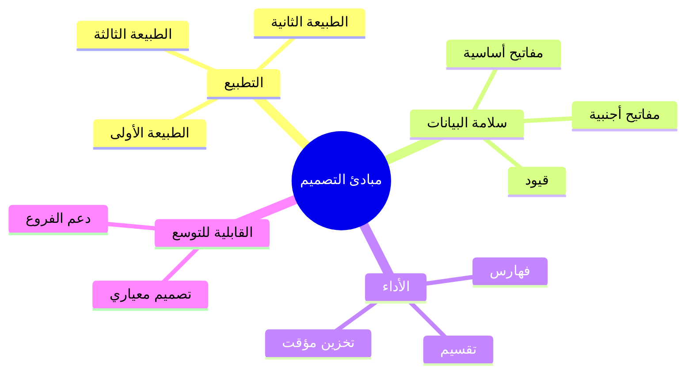
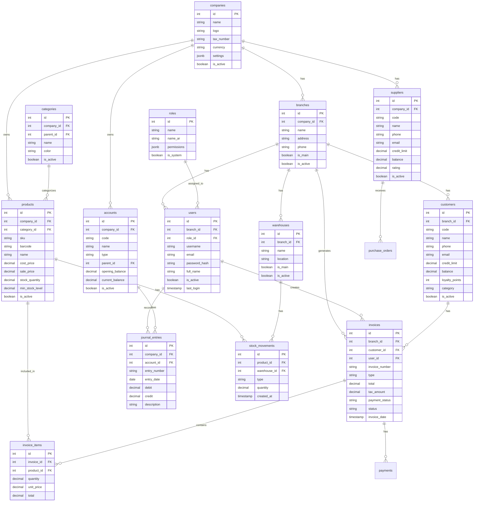

# 💾 تصميم قاعدة البيانات

## 🎯 مقدمة

يقدم هذا المستند تصميم قاعدة البيانات العلائقي للنظام مع مخططات ERD وجداول SQL كاملة.

---

## 🏛️ مبادئ التصميم



---

## 📊 مخطط الكيانات والعلاقات (ERD)



---

## 🗄️ الجداول الرئيسية

### جدول الشركات

```sql
CREATE TABLE companies (
    id              SERIAL PRIMARY KEY,
    name            VARCHAR(255) NOT NULL,
    name_en         VARCHAR(255),
    logo            VARCHAR(500),
    address         TEXT,
    phone           VARCHAR(50),
    email           VARCHAR(255),
    tax_number      VARCHAR(50),
    commercial_reg  VARCHAR(50),
    currency        VARCHAR(3) DEFAULT 'SAR',
    fiscal_year_start DATE,
    settings        JSONB DEFAULT '{}',
    is_active       BOOLEAN DEFAULT TRUE,
    created_at      TIMESTAMP DEFAULT CURRENT_TIMESTAMP,
    updated_at      TIMESTAMP DEFAULT CURRENT_TIMESTAMP
);
```

### جدول الفروع

```sql
CREATE TABLE branches (
    id              SERIAL PRIMARY KEY,
    company_id      INTEGER NOT NULL REFERENCES companies(id) ON DELETE CASCADE,
    name            VARCHAR(255) NOT NULL,
    name_en         VARCHAR(255),
    address         TEXT,
    phone           VARCHAR(50),
    email           VARCHAR(255),
    manager_name    VARCHAR(255),
    is_main         BOOLEAN DEFAULT FALSE,
    is_active       BOOLEAN DEFAULT TRUE,
    created_at      TIMESTAMP DEFAULT CURRENT_TIMESTAMP,
    updated_at      TIMESTAMP DEFAULT CURRENT_TIMESTAMP
);
```

### جدول المستخدمين

```sql
CREATE TABLE users (
    id              SERIAL PRIMARY KEY,
    branch_id       INTEGER REFERENCES branches(id) ON DELETE SET NULL,
    username        VARCHAR(100) NOT NULL UNIQUE,
    email           VARCHAR(255) NOT NULL UNIQUE,
    password_hash   VARCHAR(255) NOT NULL,
    full_name       VARCHAR(255) NOT NULL,
    phone           VARCHAR(50),
    avatar          VARCHAR(500),
    role_id         INTEGER REFERENCES roles(id),
    is_active       BOOLEAN DEFAULT TRUE,
    last_login      TIMESTAMP,
    created_at      TIMESTAMP DEFAULT CURRENT_TIMESTAMP,
    updated_at      TIMESTAMP DEFAULT CURRENT_TIMESTAMP
);
```

### جدول الأدوار

```sql
CREATE TABLE roles (
    id              SERIAL PRIMARY KEY,
    name            VARCHAR(100) NOT NULL UNIQUE,
    name_ar         VARCHAR(100),
    description     TEXT,
    permissions     JSONB NOT NULL DEFAULT '{}',
    is_system       BOOLEAN DEFAULT FALSE,
    created_at      TIMESTAMP DEFAULT CURRENT_TIMESTAMP
);

-- الأدوار الافتراضية
INSERT INTO roles (name, name_ar, description, is_system) VALUES
('super_admin', 'مدير النظام', 'صلاحيات كاملة على النظام', TRUE),
('admin', 'مدير', 'إدارة النظام والمستخدمين', TRUE),
('manager', 'مدير فرع', 'إدارة فرع واحد', TRUE),
('accountant', 'محاسب', 'العمليات المحاسبية', TRUE),
('cashier', 'كاشير', 'نقاط البيع', TRUE),
('inventory_manager', 'مدير مخزن', 'إدارة المخزون', TRUE),
('viewer', 'مشاهد', 'عرض فقط', TRUE);
```

### جدول شجرة الحسابات

```sql
CREATE TABLE accounts (
    id              SERIAL PRIMARY KEY,
    company_id      INTEGER NOT NULL REFERENCES companies(id) ON DELETE CASCADE,
    code            VARCHAR(50) NOT NULL,
    name            VARCHAR(255) NOT NULL,
    name_en         VARCHAR(255),
    type            VARCHAR(50) NOT NULL, -- asset, liability, equity, revenue, expense
    parent_id       INTEGER REFERENCES accounts(id) ON DELETE CASCADE,
    level           INTEGER DEFAULT 1,
    is_active       BOOLEAN DEFAULT TRUE,
    opening_balance DECIMAL(15,2) DEFAULT 0,
    current_balance DECIMAL(15,2) DEFAULT 0,
    created_at      TIMESTAMP DEFAULT CURRENT_TIMESTAMP,
    updated_at      TIMESTAMP DEFAULT CURRENT_TIMESTAMP,
    UNIQUE(company_id, code)
);

-- فهارس
CREATE INDEX idx_accounts_company ON accounts(company_id);
CREATE INDEX idx_accounts_type ON accounts(type);
CREATE INDEX idx_accounts_parent ON accounts(parent_id);
```

### جدول العملاء

```sql
CREATE TABLE customers (
    id              SERIAL PRIMARY KEY,
    branch_id       INTEGER REFERENCES branches(id) ON DELETE SET NULL,
    code            VARCHAR(50) NOT NULL,
    name            VARCHAR(255) NOT NULL,
    phone           VARCHAR(50),
    email           VARCHAR(255),
    address         TEXT,
    tax_number      VARCHAR(50),
    id_number       VARCHAR(50),
    credit_limit    DECIMAL(15,2) DEFAULT 0,
    credit_days     INTEGER DEFAULT 0,
    discount_percent DECIMAL(5,2) DEFAULT 0,
    balance         DECIMAL(15,2) DEFAULT 0,
    total_sales     DECIMAL(15,2) DEFAULT 0,
    loyalty_points  INTEGER DEFAULT 0,
    category        VARCHAR(50) DEFAULT 'regular', -- vip, regular, new
    is_active       BOOLEAN DEFAULT TRUE,
    created_at      TIMESTAMP DEFAULT CURRENT_TIMESTAMP,
    updated_at      TIMESTAMP DEFAULT CURRENT_TIMESTAMP,
    UNIQUE(branch_id, code)
);

CREATE INDEX idx_customers_branch ON customers(branch_id);
CREATE INDEX idx_customers_phone ON customers(phone);
CREATE INDEX idx_customers_category ON customers(category);
```

### جدول المنتجات

```sql
CREATE TABLE products (
    id              SERIAL PRIMARY KEY,
    company_id      INTEGER NOT NULL REFERENCES companies(id) ON DELETE CASCADE,
    category_id     INTEGER REFERENCES categories(id),
    sku             VARCHAR(100) NOT NULL,
    barcode         VARCHAR(100),
    name            VARCHAR(255) NOT NULL,
    name_en         VARCHAR(255),
    description     TEXT,
    unit_id         INTEGER REFERENCES units(id),
    cost_price      DECIMAL(15,2) DEFAULT 0,
    sale_price      DECIMAL(15,2) DEFAULT 0,
    wholesale_price DECIMAL(15,2) DEFAULT 0,
    tax_rate        DECIMAL(5,2) DEFAULT 15.0,
    is_tax_included BOOLEAN DEFAULT FALSE,
    stock_quantity  DECIMAL(15,3) DEFAULT 0,
    min_stock_level DECIMAL(15,3) DEFAULT 0,
    max_stock_level DECIMAL(15,3) DEFAULT 0,
    reorder_point   DECIMAL(15,3) DEFAULT 0,
    expiry_date     DATE,
    weight          DECIMAL(10,3),
    is_active       BOOLEAN DEFAULT TRUE,
    created_at      TIMESTAMP DEFAULT CURRENT_TIMESTAMP,
    updated_at      TIMESTAMP DEFAULT CURRENT_TIMESTAMP,
    UNIQUE(company_id, sku),
    UNIQUE(company_id, barcode)
);

CREATE INDEX idx_products_company ON products(company_id);
CREATE INDEX idx_products_category ON products(category_id);
CREATE INDEX idx_products_barcode ON products(barcode);
CREATE INDEX idx_products_active ON products(is_active) WHERE is_active = TRUE;
```

### جدول الفواتير

```sql
CREATE TABLE invoices (
    id              SERIAL PRIMARY KEY,
    branch_id       INTEGER NOT NULL REFERENCES branches(id),
    invoice_number  VARCHAR(50) NOT NULL,
    type            VARCHAR(20) NOT NULL DEFAULT 'sale', -- sale, purchase, return_sale, return_purchase
    customer_id     INTEGER REFERENCES customers(id),
    supplier_id     INTEGER REFERENCES suppliers(id),
    user_id         INTEGER NOT NULL REFERENCES users(id),
    subtotal        DECIMAL(15,2) DEFAULT 0,
    discount_amount DECIMAL(15,2) DEFAULT 0,
    discount_percent DECIMAL(5,2) DEFAULT 0,
    tax_amount      DECIMAL(15,2) DEFAULT 0,
    shipping_amount DECIMAL(15,2) DEFAULT 0,
    total           DECIMAL(15,2) DEFAULT 0,
    paid_amount     DECIMAL(15,2) DEFAULT 0,
    payment_status  VARCHAR(20) DEFAULT 'unpaid', -- unpaid, partial, paid
    payment_method  VARCHAR(50), -- cash, card, transfer, credit
    notes           TEXT,
    status          VARCHAR(20) DEFAULT 'completed', -- draft, completed, cancelled
    invoice_date    TIMESTAMP DEFAULT CURRENT_TIMESTAMP,
    due_date        DATE,
    created_at      TIMESTAMP DEFAULT CURRENT_TIMESTAMP,
    updated_at      TIMESTAMP DEFAULT CURRENT_TIMESTAMP,
    UNIQUE(branch_id, invoice_number)
);

CREATE INDEX idx_invoices_branch ON invoices(branch_id);
CREATE INDEX idx_invoices_customer ON invoices(customer_id);
CREATE INDEX idx_invoices_date ON invoices(invoice_date);
CREATE INDEX idx_invoices_status ON invoices(status);
```

---

## 🔍 الفهارس الموصى بها

```sql
-- فهارس للبحث
CREATE INDEX idx_products_search ON products 
    USING gin(to_tsvector('arabic', name || ' ' || COALESCE(description, '')));

CREATE INDEX idx_customers_search ON customers 
    USING gin(to_tsvector('arabic', name || ' ' || COALESCE(phone, '')));

-- فهارس للتقارير
CREATE INDEX idx_invoices_date_branch ON invoices(invoice_date, branch_id);
CREATE INDEX idx_journal_entries_date_account ON journal_entries(date, account_id);
CREATE INDEX idx_stock_movements_product_date ON stock_movements(product_id, created_at);
CREATE INDEX idx_invoice_items_product_date ON invoice_items(product_id, created_at);
```

---

## 📊 جدول سجل العمليات (Audit Logs)

```sql
CREATE TABLE audit_logs (
    id              BIGSERIAL PRIMARY KEY,
    user_id         INTEGER REFERENCES users(id),
    action          VARCHAR(50) NOT NULL, -- create, update, delete, login, etc.
    entity_type     VARCHAR(50) NOT NULL, -- product, invoice, customer, etc.
    entity_id       INTEGER,
    old_values      JSONB,
    new_values      JSONB,
    ip_address      INET,
    user_agent      TEXT,
    created_at      TIMESTAMP DEFAULT CURRENT_TIMESTAMP
);

CREATE INDEX idx_audit_user ON audit_logs(user_id);
CREATE INDEX idx_audit_action ON audit_logs(action);
CREATE INDEX idx_audit_entity ON audit_logs(entity_type, entity_id);
CREATE INDEX idx_audit_date ON audit_logs(created_at);
```

---

**الوثيقة:** تصميم قاعدة البيانات  
**الإصدار:** 1.0  
**تاريخ التحديث:** 2026-03-07
