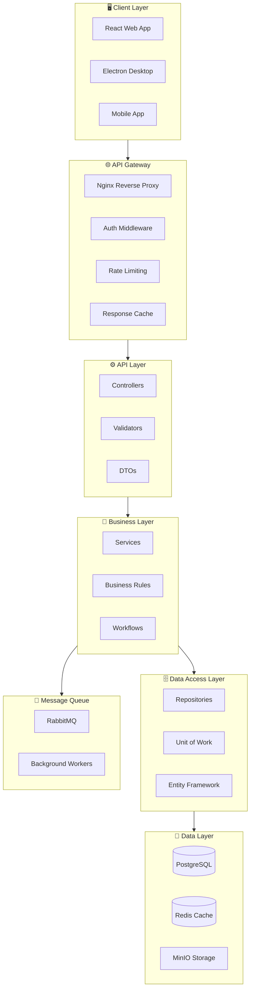
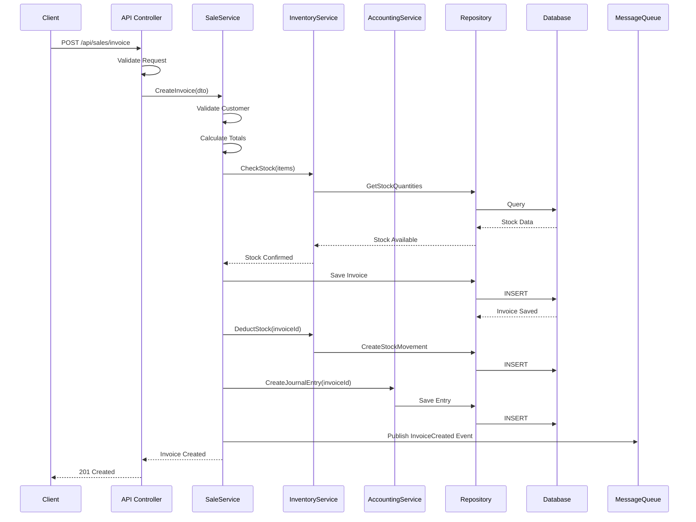
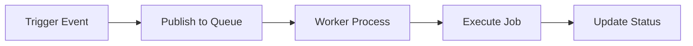
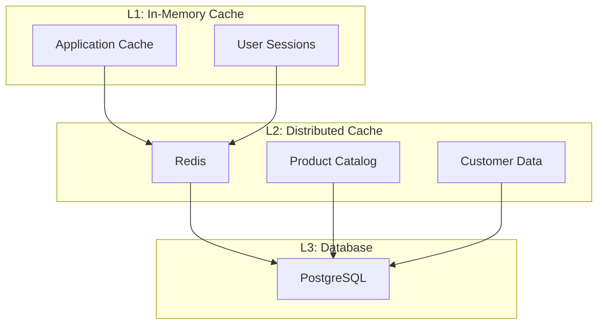

# 🏗️ بنية النظام

## 🎯 مقدمة

يقدم هذا المستند البنية المعمارية الشاملة للنظام مع تصميم الطبقات، أنماط التصميم، وتدفق البيانات.

---

## 🏛️ البنية العامة



---

## 📐 تصميم الطبقات (Layered Architecture)

### هيكل المشروع

```
ERP/
├── src/
│   ├── ERP.API/                    # طبقة API
│   │   ├── Controllers/
│   │   ├── Middleware/
│   │   ├── Filters/
│   │   └── Program.cs
│   │
│   ├── ERP.Application/            # طبقة التطبيق
│   │   ├── DTOs/
│   │   ├── Services/
│   │   ├── Validators/
│   │   └── Interfaces/
│   │
│   ├── ERP.Domain/                 # طبقة النطاق
│   │   ├── Entities/
│   │   ├── ValueObjects/
│   │   ├── Aggregates/
│   │   ├── Interfaces/
│   │   └── Events/
│   │
│   ├── ERP.Infrastructure/         # طبقة البنية التحتية
│   │   ├── Data/
│   │   │   ├── Configurations/
│   │   │   ├── Migrations/
│   │   │   └── Repositories/
│   │   ├── Services/
│   │   └── External/
│   │
│   └── ERP.Web/                    # Frontend
│       ├── src/
│       │   ├── components/
│       │   ├── pages/
│       │   ├── hooks/
│       │   ├── services/
│       │   └── store/
│       └── package.json
│
├── tests/
├── docs/
└── docker-compose.yml
```

---

## 🔄 تدفق البيانات

### عملية البيع الكاملة



---

## 🏗️ أنماط التصميم

### Repository Pattern

```csharp
// Interface
public interface IRepository<T> where T : BaseEntity
{
    Task<T?> GetByIdAsync(int id);
    Task<IEnumerable<T>> GetAllAsync();
    Task<IEnumerable<T>> FindAsync(Expression<Func<T, bool>> predicate);
    Task<T> AddAsync(T entity);
    Task UpdateAsync(T entity);
    Task DeleteAsync(T entity);
    Task<int> SaveChangesAsync();
}

// Implementation
public class Repository<T> : IRepository<T> where T : BaseEntity
{
    protected readonly AppDbContext _context;
    protected readonly DbSet<T> _dbSet;

    public Repository(AppDbContext context)
    {
        _context = context;
        _dbSet = context.Set<T>();
    }

    public virtual async Task<T?> GetByIdAsync(int id)
    {
        return await _dbSet.FindAsync(id);
    }

    public virtual async Task<IEnumerable<T>> GetAllAsync()
    {
        return await _dbSet.ToListAsync();
    }

    public virtual async Task<T> AddAsync(T entity)
    {
        entity.CreatedAt = DateTime.UtcNow;
        await _dbSet.AddAsync(entity);
        return entity;
    }
}
```

### Unit of Work Pattern

```csharp
public interface IUnitOfWork : IDisposable
{
    IProductRepository Products { get; }
    IInvoiceRepository Invoices { get; }
    ICustomerRepository Customers { get; }
    IAccountRepository Accounts { get; }
    
    Task<int> SaveChangesAsync();
    Task BeginTransactionAsync();
    Task CommitTransactionAsync();
    Task RollbackTransactionAsync();
}

public class UnitOfWork : IUnitOfWork
{
    private readonly AppDbContext _context;
    
    public IProductRepository Products { get; }
    public IInvoiceRepository Invoices { get; }
    public ICustomerRepository Customers { get; }
    public IAccountRepository Accounts { get; }

    public UnitOfWork(AppDbContext context)
    {
        _context = context;
        Products = new ProductRepository(context);
        Invoices = new InvoiceRepository(context);
        Customers = new CustomerRepository(context);
        Accounts = new AccountRepository(context);
    }

    public async Task<int> SaveChangesAsync()
    {
        return await _context.SaveChangesAsync();
    }

    public async Task BeginTransactionAsync()
    {
        await _context.Database.BeginTransactionAsync();
    }

    public async Task CommitTransactionAsync()
    {
        await _context.Database.CommitTransactionAsync();
    }

    public async Task RollbackTransactionAsync()
    {
        await _context.Database.RollbackTransactionAsync();
    }
}
```

---

## 🔄 المعالجة غير المتزامنة

### Background Jobs



### أنواع المهام الخلفية

| المهمة | التكرار | الوصف |
|--------|---------|-------|
| **Daily Reports** | يومي 2:00ص | توليد التقارير اليومية |
| **Stock Alerts** | كل ساعة | فحص المخزون وإرسال تنبيهات |
| **Backup** | يومي 1:00ص | نسخ احتياطي لقاعدة البيانات |
| **Loyalty Points** | يومي | حساب وتوزيع النقاط |
| **Invoice Reminders** | يومي | إرسال تذكيرات الفواتير |

---

## 📊 Caching Strategy

### هرمية التخزين المؤقت



### سياسة التخزين المؤقت

| البيانات | TTL | الاستراتيجية |
|----------|-----|--------------|
| Product Catalog | 5 دقائق | Cache-Aside |
| User Sessions | 24 ساعة | Write-Through |
| Stock Quantities | 1 دقيقة | Read-Through |
| Reports | 1 ساعة | Cache-Aside |

---

**الوثيقة:** بنية النظام  
**الإصدار:** 1.0  
**تاريخ التحديث:** 2026-03-07
