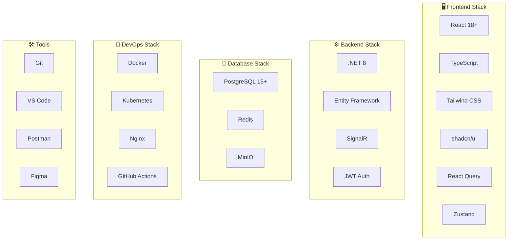
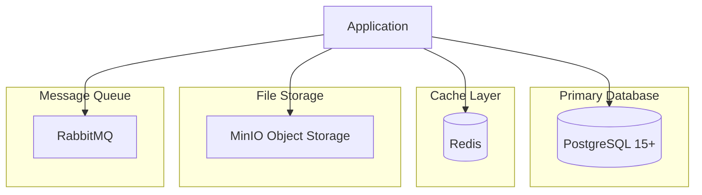
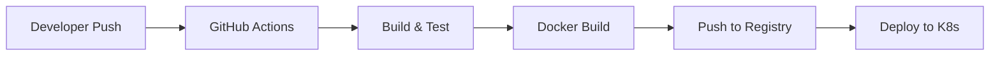

# ⚙️ Stack التقني

## 🎯 مقدمة

يقدم هذا المستند التقنيات والأدوات المستخدمة في تطوير النظام مع تبرير اختيار كل تقنية.

---

## 🏛️ Stack العام



---

## 🖥️ Frontend Stack

### React 18+ مع TypeScript

```
┌─────────────────────────────────────────────────────────────────┐
│                    Frontend Architecture                        │
├─────────────────────────────────────────────────────────────────┤
│                                                                 │
│  ┌─────────────────────────────────────────────────────────┐   │
│  │                    React 18 + TypeScript                │   │
│  │                                                         │   │
│  │  ┌─────────────┐  ┌─────────────┐  ┌─────────────┐     │   │
│  │  │  shadcn/ui  │  │  Tailwind   │  │  React Query│     │   │
│  │  │  Components │  │    CSS      │  │   (TanStack)│     │   │
│  │  └─────────────┘  └─────────────┘  └─────────────┘     │   │
│  │                                                         │   │
│  │  ┌─────────────┐  ┌─────────────┐  ┌─────────────┐     │   │
│  │  │   Zustand   │  │ React Router│  │ React Hook  │     │   │
│  │  │   State     │  │     v6      │  │    Form     │     │   │
│  │  └─────────────┘  └─────────────┘  └─────────────┘     │   │
│  │                                                         │   │
│  └─────────────────────────────────────────────────────────┘   │
│                                                                 │
│  ┌─────────────────────────────────────────────────────────┐   │
│  │                    Project Structure                    │   │
│  │                                                         │   │
│  │  src/                                                   │   │
│  │  ├── components/     # مكونات قابلة لإعادة الاستخدام   │   │
│  │  ├── pages/          # صفحات التطبيق                   │   │
│  │  ├── hooks/          # Custom Hooks                    │   │
│  │  ├── services/       # API Services                    │   │
│  │  ├── store/          # State Management                │   │
│  │  ├── types/          # TypeScript Types                │   │
│  │  ├── utils/          # Utilities                       │   │
│  │  └── styles/         # Global Styles                   │   │
│  │                                                         │   │
│  └─────────────────────────────────────────────────────────┘   │
└─────────────────────────────────────────────────────────────────┘
```

### حزم npm الرئيسية

| الحزمة | الإصدار | الاستخدام |
|--------|---------|-----------|
| `react` | ^18.2.0 | Framework UI |
| `react-dom` | ^18.2.0 | DOM Renderer |
| `typescript` | ^5.0.0 | Type Safety |
| `@tanstack/react-query` | ^5.0.0 | Data Fetching |
| `zustand` | ^4.4.0 | State Management |
| `react-router-dom` | ^6.20.0 | Routing |
| `react-hook-form` | ^7.48.0 | Form Management |
| `zod` | ^3.22.0 | Schema Validation |
| `tailwindcss` | ^3.3.0 | Styling |
| `lucide-react` | ^0.294.0 | Icons |
| `recharts` | ^2.10.0 | Charts |
| `date-fns` | ^2.30.0 | Date Utilities |

---

## ⚙️ Backend Stack

### .NET 8 Architecture

```
┌─────────────────────────────────────────────────────────────────┐
│                    .NET 8 Backend Architecture                  │
├─────────────────────────────────────────────────────────────────┤
│                                                                 │
│  ┌─────────────────────────────────────────────────────────┐   │
│  │                    ASP.NET Core 8                       │   │
│  │                                                         │   │
│  │  ┌─────────────┐  ┌─────────────┐  ┌─────────────┐     │   │
│  │  │  Controllers│  │   Services  │  │Repositories │     │   │
│  │  │   (API)     │  │  (Business) │  │  (Data)     │     │   │
│  │  └─────────────┘  └─────────────┘  └─────────────┘     │   │
│  │                                                         │   │
│  │  ┌─────────────┐  ┌─────────────┐  ┌─────────────┐     │   │
│  │  │     EF      │  │    JWT      │  │   SignalR   │     │   │
│  │  │   Core      │  │    Auth     │  │  (Real-time)│     │   │
│  │  └─────────────┘  └─────────────┘  └─────────────┘     │   │
│  │                                                         │   │
│  └─────────────────────────────────────────────────────────┘   │
│                                                                 │
│  ┌─────────────────────────────────────────────────────────┐   │
│  │                    NuGet Packages                       │   │
│  │                                                         │   │
│  │  • Microsoft.EntityFrameworkCore 8.0                   │   │
│  │  • Npgsql.EntityFrameworkCore.PostgreSQL 8.0           │   │
│  │  • Microsoft.AspNetCore.Authentication.JwtBearer       │   │
│  │  • AutoMapper 12.0                                     │   │
│  │  • FluentValidation 11.0                               │   │
│  │  • Serilog 3.0                                         │   │
│  │  • Swashbuckle.AspNetCore 6.5                          │   │
│  │  • Hangfire 1.8                                        │   │
│  │                                                         │   │
│  └─────────────────────────────────────────────────────────┘   │
└─────────────────────────────────────────────────────────────────┘
```

---

## 💾 Database Stack

### PostgreSQL + Redis



### مواصفات قاعدة البيانات

| المكون | الإصدار | الاستخدام |
|--------|---------|-----------|
| PostgreSQL | 15+ | قاعدة البيانات الرئيسية |
| Redis | 7+ | التخزين المؤقت والجلسات |
| MinIO | Latest | تخزين الملفات |
| RabbitMQ | 3.12+ | قوائم الانتظار |

---

## 🚀 DevOps Stack

### CI/CD Pipeline



### Dockerfile

```dockerfile
# Backend Dockerfile
FROM mcr.microsoft.com/dotnet/aspnet:8.0 AS base
WORKDIR /app
EXPOSE 80
EXPOSE 443

FROM mcr.microsoft.com/dotnet/sdk:8.0 AS build
WORKDIR /src
COPY ["ERP.API/ERP.API.csproj", "ERP.API/"]
COPY ["ERP.Application/ERP.Application.csproj", "ERP.Application/"]
COPY ["ERP.Domain/ERP.Domain.csproj", "ERP.Domain/"]
COPY ["ERP.Infrastructure/ERP.Infrastructure.csproj", "ERP.Infrastructure/"]
RUN dotnet restore "ERP.API/ERP.API.csproj"
COPY . .
WORKDIR "/src/ERP.API"
RUN dotnet build "ERP.API.csproj" -c Release -o /app/build

FROM build AS publish
RUN dotnet publish "ERP.API.csproj" -c Release -o /app/publish

FROM base AS final
WORKDIR /app
COPY --from=publish /app/publish .
ENTRYPOINT ["dotnet", "ERP.API.dll"]
```

---

## 📋 ملخص Stack التقني

| الطبقة | التقنية | التبرير |
|--------|---------|---------|
| **Frontend** | React 18 + TypeScript | أداء عالي، ecosystem قوي |
| **Styling** | Tailwind CSS + shadcn/ui | تطوير سريع، تصميم متسق |
| **State** | Zustand | بسيط، TypeScript-friendly |
| **Data** | React Query | Caching ذكي، Background updates |
| **Backend** | .NET 8 | أداء عالي، أمان، Type Safety |
| **ORM** | Entity Framework | Productivity، LINQ |
| **Database** | PostgreSQL | Reliability، JSON support |
| **Cache** | Redis | Speed، Pub/Sub |
| **Auth** | JWT | Stateless، Scalable |
| **Container** | Docker + K8s | Portability، Scaling |

---

**الوثيقة:** Stack التقني  
**الإصدار:** 1.0  
**تاريخ التحديث:** 2026-03-07
