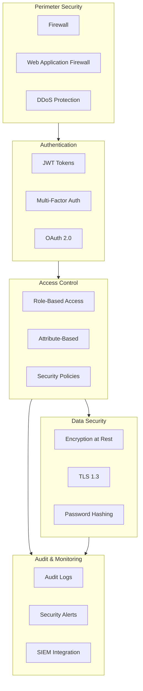
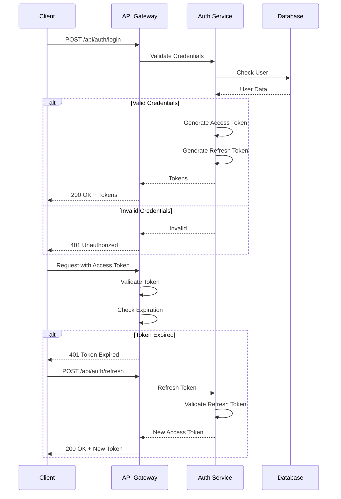
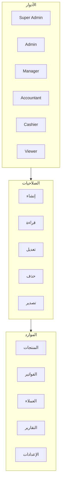
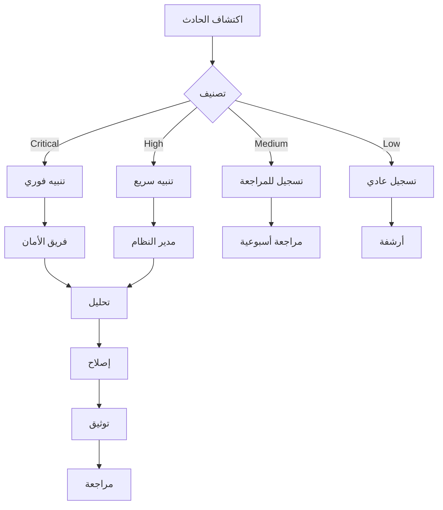

# 🔒 نظام الأمان

## 🎯 مقدمة

يقدم هذا المستند استراتيجية الأمان الشاملة للنظام مع التركيز على حماية البيانات والمعاملات.

---

## 🏛️ هيكل الأمان



---

## 🔐 المصادقة (Authentication)

### JWT Authentication Flow



### إعدادات JWT

```csharp
// appsettings.json
{
  "Jwt": {
    "Secret": "your-256-bit-secret-key-here-min-32-chars",
    "Issuer": "ERP-System",
    "Audience": "ERP-Client",
    "AccessTokenExpiryMinutes": 15,
    "RefreshTokenExpiryDays": 7
  }
}

// Program.cs
builder.Services.AddAuthentication(JwtBearerDefaults.AuthenticationScheme)
    .AddJwtBearer(options =>
    {
        options.TokenValidationParameters = new TokenValidationParameters
        {
            ValidateIssuer = true,
            ValidateAudience = true,
            ValidateLifetime = true,
            ValidateIssuerSigningKey = true,
            ValidIssuer = builder.Configuration["Jwt:Issuer"],
            ValidAudience = builder.Configuration["Jwt:Audience"],
            IssuerSigningKey = new SymmetricSecurityKey(
                Encoding.UTF8.GetBytes(builder.Configuration["Jwt:Secret"])
            ),
            ClockSkew = TimeSpan.Zero
        };
    });
```

---

## 🛡️ التفويض (Authorization)

### RBAC (Role-Based Access Control)



### جدول الصلاحيات

| الدور | المنتجات | الفواتير | العملاء | التقارير | الإعدادات |
|-------|----------|----------|---------|----------|-----------|
| Super Admin | ✅✅✅✅ | ✅✅✅✅ | ✅✅✅✅ | ✅✅✅✅ | ✅✅✅✅ |
| Admin | ✅✅✅ | ✅✅✅ | ✅✅✅ | ✅✅✅ | ✅✅ |
| Manager | ✅✅ | ✅✅ | ✅✅ | ✅✅ | ✅ |
| Accountant | ✅ | ✅ | ✅ | ✅✅ | ❌ |
| Cashier | ✅ | ✅✅ | ✅ | ❌ | ❌ |
| Viewer | ✅ | ✅ | ✅ | ✅ | ❌ |

*✅ = Create, ✅ = Read, ✅ = Update, ✅ = Delete*

---

## 🔒 تشفير البيانات

### تشفير البيانات الساكنة

```csharp
public class EncryptionService
{
    private readonly byte[] _key;
    private readonly byte[] _iv;
    
    public EncryptionService(IConfiguration config)
    {
        _key = Convert.FromBase64String(config["Encryption:Key"]);
        _iv = Convert.FromBase64String(config["Encryption:IV"]);
    }
    
    public string Encrypt(string plainText)
    {
        using var aes = Aes.Create();
        aes.Key = _key;
        aes.IV = _iv;
        
        var encryptor = aes.CreateEncryptor();
        var bytes = Encoding.UTF8.GetBytes(plainText);
        var encrypted = encryptor.TransformFinalBlock(bytes, 0, bytes.Length);
        
        return Convert.ToBase64String(encrypted);
    }
    
    public string Decrypt(string cipherText)
    {
        using var aes = Aes.Create();
        aes.Key = _key;
        aes.IV = _iv;
        
        var decryptor = aes.CreateDecryptor();
        var bytes = Convert.FromBase64String(cipherText);
        var decrypted = decryptor.TransformFinalBlock(bytes, 0, bytes.Length);
        
        return Encoding.UTF8.GetString(decrypted);
    }
}
```

### تشفير كلمات المرور

```csharp
public class PasswordService
{
    public string HashPassword(string password)
    {
        return BCrypt.Net.BCrypt.HashPassword(password, workFactor: 12);
    }
    
    public bool VerifyPassword(string password, string hash)
    {
        return BCrypt.Net.BCrypt.Verify(password, hash);
    }
}
```

---

## 📋 سجل التدقيق (Audit Logging)

### هيكل السجل

```csharp
public class AuditLog
{
    public int Id { get; set; }
    public int? UserId { get; set; }
    public string Action { get; set; } // Create, Update, Delete, Login, etc.
    public string EntityType { get; set; } // Product, Invoice, Customer, etc.
    public int? EntityId { get; set; }
    public string OldValues { get; set; }
    public string NewValues { get; set; }
    public string IpAddress { get; set; }
    public string UserAgent { get; set; }
    public DateTime CreatedAt { get; set; }
}
```

### أنواع الأحداث المسجلة

| الحدث | الوصف | المستوى |
|-------|-------|---------|
| **User.Login** | تسجيل دخول المستخدم | INFO |
| **User.Logout** | تسجيل خروج المستخدم | INFO |
| **User.LoginFailed** | محاولة تسجيل دخول فاشلة | WARNING |
| **Entity.Created** | إنشاء كيان جديد | INFO |
| **Entity.Updated** | تحديث كيان | INFO |
| **Entity.Deleted** | حذف كيان | WARNING |
| **Permission.Denied** | رفض صلاحية | ERROR |
| **Data.Export** | تصدير بيانات | INFO |

---

## 🚨 إدارة الحوادث

### تصنيف الحوادث

| المستوى | الوصف | وقت الاستجابة |
|---------|-------|--------------|
| **Critical** | اختراق، فقدان بيانات | فوري |
| **High** | محاولات تسجيل دخول فاشلة متكررة | 1 ساعة |
| **Medium** | أنشطة مشبوهة | 4 ساعات |
| **Low** | أحداث عادية | 24 ساعة |

### إجراءات الاستجابة



---

## 📊 متطلبات الامتثال

| المعيار | الوصف | الحالة |
|---------|-------|--------|
| **GDPR** | حماية بيانات الاتحاد الأوروبي | ✅ متوافق |
| **PCI DSS** | معايير بطاقات الدفع | ✅ متوافق |
| **ISO 27001** | إدارة أمان المعلومات | 🔄 قيد التنفيذ |
| **SAMA** | متطلبات البنك المركزي السعودي | ✅ متوافق |

---

**الوثيقة:** نظام الأمان  
**الإصدار:** 1.0  
**تاريخ التحديث:** 2026-03-07
