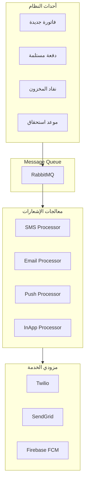

# 📱 نظام الإشعارات والـ SMS

## 🎯 مقدمة

يقدم هذا المستند تصميم نظام الإشعارات المتكامل مع دعم SMS، البريد الإلكتروني، والإشعارات داخل التطبيق.

---

## 🏛️ هيكل النظام



---

## 📋 أنواع الإشعارات

### الإشعارات التجارية

| الحدث | القناة | المحتوى | المستلم |
|-------|--------|---------|---------|
| **فاتورة جديدة** | SMS, Email | رقم الفاتورة والمبلغ | العميل |
| **دفعة مستلمة** | SMS | تأكيد استلام المبلغ | العميل |
| **نقاط جديدة** | SMS, Push | عدد النقاط المكتسبة | العميل |
| **عرض خاص** | SMS, Email, Push | تفاصيل العرض | العملاء |

### الإشعارات التشغيلية

| الحدث | القناة | المحتوى | المستلم |
|-------|--------|---------|---------|
| **نفاد المخزون** | Email, InApp | المنتج والكمية | المشتريات |
| **فاتورة آجلة** | Email | تذكير بالدفع | المحاسب |
| **تقرير يومي** | Email | ملخص المبيعات | المدير |
| **خطأ في النظام** | Email, SMS | تفاصيل الخطأ | المطور |

---

## 📱 قوالب SMS

### قوالب العملاء

```
┌─────────────────────────────────────────────────────────────────┐
│                    قوالب SMS للعملاء                            │
├─────────────────────────────────────────────────────────────────┤
│                                                                 │
│  فاتورة جديدة:                                                  │
│  ─────────────────────────────────────────────────────────────  │
│  عزيزي [الاسم]، تم إصدار فاتورة جديدة رقم [رقم الفاتورة]        │
│  بمبلغ [المبلغ] ريال. شكراً لتعاملكم معنا.                      │
│  ─────────────────────────────────────────────────────────────  │
│                                                                 │
│  دفعة مستلمة:                                                   │
│  ─────────────────────────────────────────────────────────────  │
│  عزيزي [الاسم]، تم استلام دفعة بمبلغ [المبلغ] ريال.             │
│  رصيدك الحالي: [الرصيد] ريال.                                   │
│  ─────────────────────────────────────────────────────────────  │
│                                                                 │
│  نقاط جديدة:                                                    │
│  ─────────────────────────────────────────────────────────────  │
│  تهانينا! لقد حصلت على [النقاط] نقطة جديدة.                     │
│  رصيدك الكلي: [الرصيد الكلي] نقطة.                              │
│  ─────────────────────────────────────────────────────────────  │
│                                                                 │
│  تذكير دفع:                                                     │
│  ─────────────────────────────────────────────────────────────  │
│  عزيزي [الاسم]، تذكير بسداد فاتورة رقم [رقم]                   │
│  بمبلغ [المبلغ] ريال. تاريخ الاستحقاق: [التاريخ].              │
│  ─────────────────────────────────────────────────────────────  │
│                                                                 │
└─────────────────────────────────────────────────────────────────┘
```

### قوالب الموظفين

```
┌─────────────────────────────────────────────────────────────────┐
│                    قوالب SMS للموظفين                           │
├─────────────────────────────────────────────────────────────────┤
│                                                                 │
│  نفاد المخزون:                                                  │
│  ─────────────────────────────────────────────────────────────  │
│  تنبيه: المنتج [اسم المنتج] وصل للحد الأدنى.                    │
│  الكمية الحالية: [الكمية]. يرجى إعادة الطلب.                    │
│  ─────────────────────────────────────────────────────────────  │
│                                                                 │
│  تقرير يومي:                                                    │
│  ─────────────────────────────────────────────────────────────  │
│  ملخص المبيعات - [التاريخ]:                                     │
│  إجمالي المبيعات: [المبلغ] ريال                                 │
│  عدد الفواتير: [العدد]                                          │
│  أفضل منتج: [المنتج]                                            │
│  ─────────────────────────────────────────────────────────────  │
│                                                                 │
└─────────────────────────────────────────────────────────────────┘
```

---

## 📧 قوالب البريد الإلكتروني

### قالب فاتورة

```html
<!DOCTYPE html>
<html dir="rtl">
<head>
    <meta charset="UTF-8">
    <title>فاتورة جديدة</title>
</head>
<body style="font-family: Arial, sans-serif; direction: rtl;">
    <div style="max-width: 600px; margin: 0 auto; padding: 20px;">
        <div style="text-align: center; margin-bottom: 30px;">
            <h1 style="color: #0F172A;">فاتورة جديدة</h1>
        </div>
        
        <div style="background: #f8fafc; padding: 20px; border-radius: 8px;">
            <p>عزيزي <strong>{{customer_name}}</strong>،</p>
            <p>تم إصدار فاتورة جديدة لكم:</p>
            
            <table style="width: 100%; margin: 20px 0;">
                <tr>
                    <td style="padding: 10px; background: #fff;">رقم الفاتورة:</td>
                    <td style="padding: 10px; background: #fff;"><strong>{{invoice_number}}</strong></td>
                </tr>
                <tr>
                    <td style="padding: 10px; background: #fff;">التاريخ:</td>
                    <td style="padding: 10px; background: #fff;">{{invoice_date}}</td>
                </tr>
                <tr>
                    <td style="padding: 10px; background: #fff;">المبلغ:</td>
                    <td style="padding: 10px; background: #fff;"><strong style="color: #3B82F6;">{{total}} ريال</strong></td>
                </tr>
            </table>
            
            <div style="text-align: center; margin-top: 30px;">
                <a href="{{invoice_url}}" 
                   style="background: #3B82F6; color: white; padding: 12px 30px; 
                          text-decoration: none; border-radius: 6px; display: inline-block;">
                    عرض الفاتورة
                </a>
            </div>
        </div>
        
        <p style="text-align: center; color: #64748B; margin-top: 30px;">
            شكراً لتعاملكم معنا!
        </p>
    </div>
</body>
</html>
```

---

## ⚙️ إعدادات النظام

### إعدادات SMS

```json
{
  "Sms": {
    "Provider": "Twilio",
    "AccountSid": "your-account-sid",
    "AuthToken": "your-auth-token",
    "FromNumber": "+1234567890",
    "Enabled": true,
    "RateLimit": {
      "PerMinute": 10,
      "PerHour": 100
    }
  }
}
```

### إعدادات البريد

```json
{
  "Email": {
    "Provider": "SendGrid",
    "ApiKey": "your-api-key",
    "FromEmail": "noreply@erpsystem.com",
    "FromName": "ERP System",
    "Enabled": true
  }
}
```

---

## 📊 إحصائيات الإشعارات

```
┌─────────────────────────────────────────────────────────────────┐
│                    إحصائيات الإشعارات                           │
│                    شهر فبراير 2026                              │
├─────────────────────────────────────────────────────────────────┤
│                                                                 │
│  إجمالي الإشعارات المرسلة: 15,234                              │
│                                                                 │
│  حسب القناة:                                                    │
│  ┌─────────────────────────────────────────────────────────┐   │
│  │  SMS:      8,234 (54%)    ████████████████████        │   │
│  │  Email:    4,500 (30%)    ███████████                 │   │
│  │  Push:     2,000 (13%)    █████                       │   │
│  │  InApp:      500 (3%)     █                           │   │
│  └─────────────────────────────────────────────────────────┘   │
│                                                                 │
│  معدل النجاح: 98.5%                                            │
│  معدل الفشل: 1.5%                                              │
│                                                                 │
│  حسب الحالة:                                                    │
│  ✅ ناجح: 15,006 (98.5%)                                        │
│  ❌ فاشل: 228 (1.5%)                                            │
│                                                                 │
└─────────────────────────────────────────────────────────────────┘
```

---

**الوثيقة:** نظام الإشعارات والـ SMS  
**الإصدار:** 1.0  
**تاريخ التحديث:** 2026-03-07
