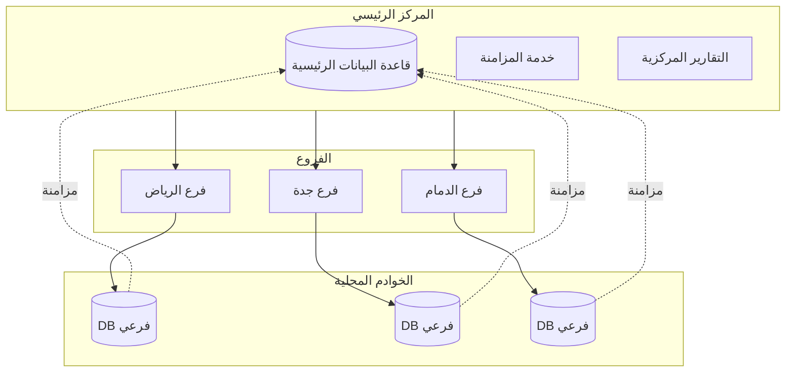
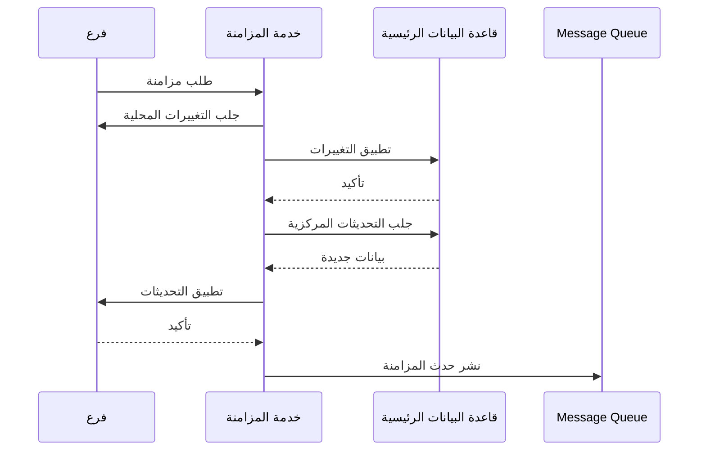
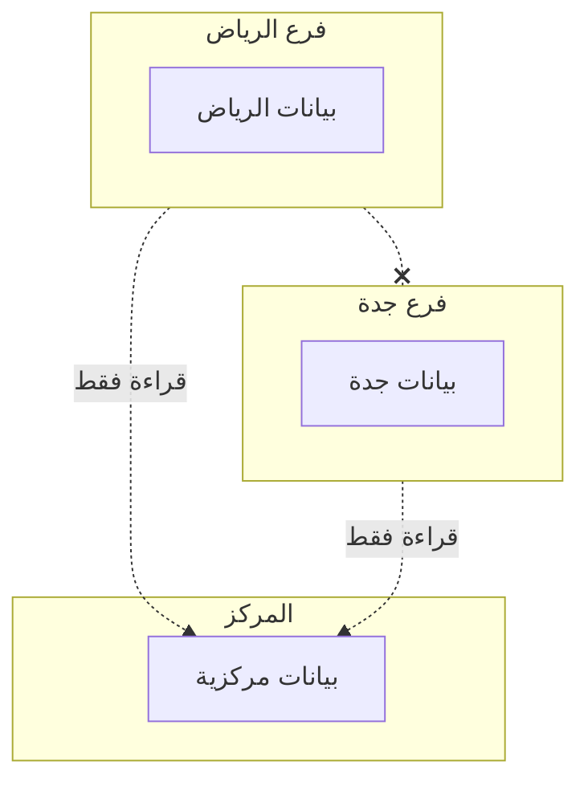

# 🏪 نظام الفروع المتعددة

## 🎯 مقدمة

يقدم هذا المستند تصميم نظام الفروع المتعددة مع إدارة مركزية ومزامنة البيانات.

---

## 🏛️ هيكل الفروع



---

## 📊 هيكل البيانات

### البيانات المركزية

| البيانات | الوصف | المزامنة |
|----------|-------|----------|
| **الشركة** | بيانات الشركة | مركزي |
| **شجرة الحسابات** | الهيكل المحاسبي | مركزي |
| **المنتجات** | كتالوج المنتجات | مركزي |
| **الموردين** | بيانات الموردين | مركزي |
| **الفروع** | إعدادات الفروع | مركزي |

### البيانات المحلية

| البيانات | الوصف | المزامنة |
|----------|-------|----------|
| **العملاء** | بيانات العملاء | محلي + مزامنة |
| **الفواتير** | فواتير الفرع | محلي + مزامنة |
| **المخزون** | مخزون الفرع | محلي + مزامنة |
| **المستخدمين** | مستخدمي الفرع | محلي |

---

## 🔄 آلية المزامنة

### تدفق المزامنة



### جدول المزامنة

| البيانات | التكرار | الاتجاه |
|----------|---------|---------|
| **الفواتير** | فوري | فرع ←→ مركز |
| **المخزون** | كل 5 دقائق | فرع ←→ مركز |
| **العملاء** | كل 15 دقيقة | فرع ←→ مركز |
| **التقارير** | كل ساعة | فرع → مركز |

---

## 📈 التقارير المركزية

### لوحة تحكم الفروع

```
┌─────────────────────────────────────────────────────────────────┐
│                    تقرير الفروع                                 │
│                    شهر فبراير 2026                              │
├─────────────────────────────────────────────────────────────────┤
│                                                                 │
│  المقارنة بين الفروع:                                           │
│  ┌─────────────────────────────────────────────────────────┐   │
│  │                                                         │   │
│  │  المبيعات (آلاف ريال)                                   │   │
│  │                                                         │   │
│  │  الرياض    ████████████████████████████  450K         │   │
│  │  جدة       ████████████████████████      380K         │   │
│  │  الدمام    ████████████████████          320K         │   │
│  │                                                         │   │
│  └─────────────────────────────────────────────────────────┘   │
│                                                                 │
│  ملخص الفروع:                                                   │
│  ┌───────────┬──────────┬──────────┬──────────┬────────────┐   │
│  │ الفرع     │ المبيعات │ الأرباح  │ العملاء  │ المنتجات   │   │
│  ├───────────┼──────────┼──────────┼──────────┼────────────┤   │
│  │ الرياض    │ 450,000  │ 90,000   │ 1,234    │ 2,500      │   │
│  │ جدة       │ 380,000  │ 76,000   │ 987      │ 2,200      │   │
│  │ الدمام    │ 320,000  │ 64,000   │ 756      │ 1,800      │   │
│  ├───────────┼──────────┼──────────┼──────────┼────────────┤   │
│  │ الإجمالي  │ 1,150,000│ 230,000  │ 2,977    │ 6,500      │   │
│  └───────────┴──────────┴──────────┴──────────┴────────────┘   │
│                                                                 │
└─────────────────────────────────────────────────────────────────┘
```

---

## ⚙️ إعدادات الفرع

### بيانات الفرع

```json
{
  "branch": {
    "id": 1,
    "code": "RYD-001",
    "name": "فرع الرياض",
    "name_en": "Riyadh Branch",
    "address": "الرياض، حي الورود",
    "phone": "011-1234567",
    "email": "riyadh@company.com",
    "manager": "أحمد محمد",
    "is_main": true,
    "settings": {
      "currency": "SAR",
      "tax_rate": 15,
      "invoice_prefix": "RYD",
      "working_hours": {
        "start": "08:00",
        "end": "23:00"
      },
      "sync": {
        "enabled": true,
        "interval_minutes": 5
      }
    }
  }
}
```

---

## 🔐 الأمان بين الفروع

### عزل البيانات



### سياسة الوصول

| الدور | الوصول |
|-------|--------|
| **مدير فرع** | فرعه فقط |
| **مدير منطقة** | فروع منطقته |
| **مدير عام** | جميع الفروع |
| **محاسب مركزي** | جميع الفروع (قراءة) |

---

**الوثيقة:** نظام الفروع المتعددة  
**الإصدار:** 1.0  
**تاريخ التحديث:** 2026-03-07
