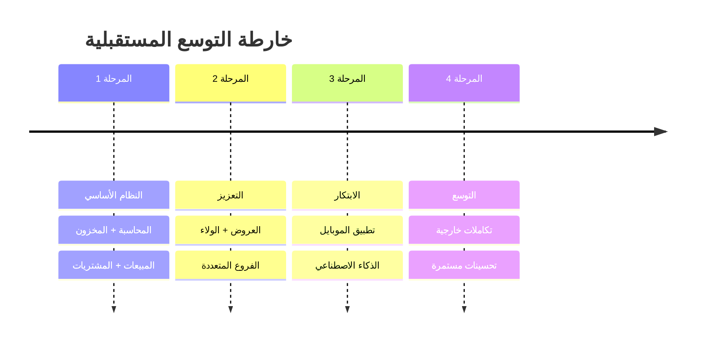
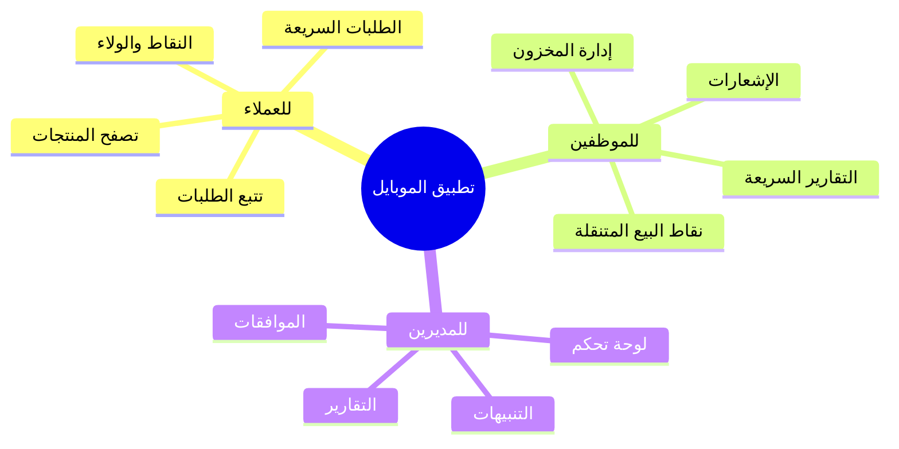
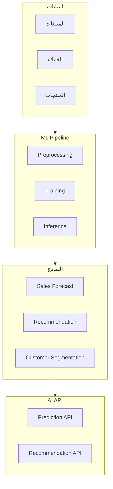
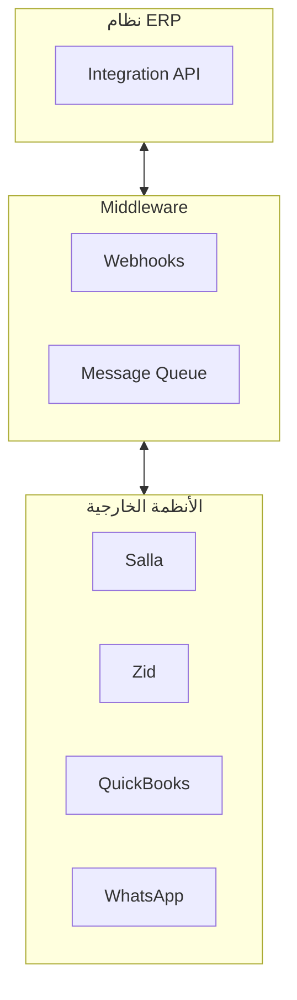

# 🔮 التوسع المستقبلي

## 🎯 مقدمة

يقدم هذا المستند خطط التوسع المستقبلية للنظام مع التقنيات والميزات المقترحة.

---

## 🗺️ خارطة التوسع



---

## 📱 تطبيق الموبايل

### الميزات المقترحة



### التقنيات

| المنصة | التقنية |
|--------|---------|
| **iOS** | Swift / SwiftUI |
| **Android** | Kotlin / Jetpack Compose |
| **Cross-Platform** | React Native / Flutter |

---

## 🤖 الذكاء الاصطناعي والتعلم الآلي

### التطبيقات المقترحة

| التطبيق | الوصف | الفائدة |
|---------|-------|---------|
| **توقع المبيعات** | التنبؤ بالمبيعات المستقبلية | تخطيط أفضل للمخزون |
| **توصيات المنتجات** | اقتراح منتجات للعملاء | زيادة المبيعات |
| **تصنيف العملاء** | تجميع العملاء تلقائياً | استهداف أفضل |
| **كشف الاحتيال** | اكتشاف العمليات المشبوهة | أمان أعلى |
| **روبوت المحادثة** | مساعد افتراضي | خدمة عملاء 24/7 |

### بنية AI



---

## 🔗 التكاملات الخارجية

### التكاملات المقترحة

| النظام | الوصف | الأولوية |
|--------|-------|----------|
| **Salla** | منصة التجارة الإلكترونية | عالية |
| **Zid** | منصة التجارة الإلكترونية | عالية |
| **QuickBooks** | برنامج محاسبي | متوسطة |
| **Xero** | برنامج محاسبي | متوسطة |
| **Slack** | التواصل الداخلي | منخفضة |
| **WhatsApp Business** | التواصل مع العملاء | عالية |

### بنية التكامل



---

## 🌍 التعدد اللغوي

### اللغات المدعومة

| اللغة | الحالة | الأولوية |
|-------|--------|----------|
| **العربية** | ✅ مدعوم | أساسي |
| **الإنجليزية** | 🔄 قيد التطوير | عالية |
| **الفرنسية** | 📋 مخطط | متوسطة |
| **الأردية** | 📋 مخطط | منخفضة |

### بنية التعدد اللغوي

```
src/
├── locales/
│   ├── ar/
│   │   ├── common.json
│   │   ├── sales.json
│   │   └── inventory.json
│   ├── en/
│   │   ├── common.json
│   │   ├── sales.json
│   │   └── inventory.json
│   └── fr/
│       ├── common.json
│       ├── sales.json
│       └── inventory.json
```

---

## 📊 التقارير المتقدمة

### التقارير المقترحة

| التقرير | الوصف | الأولوية |
|---------|-------|----------|
| **تحليل ABC** | تصنيف المنتجات حسب الأهمية | عالية |
| **تحليل XYZ** | تصنيف المنتجات حسب الاستقرار | متوسطة |
| **تحليل FSN** | تصنيف المنتجات حسب الحركة | متوسطة |
| **تحليل السلة** | منتجات تُشترى معاً | عالية |
| **تحليل RFM** | تصنيف العملاء | عالية |

---

## 🚀 التقنيات المستقبلية

### تقنيات قيد الدراسة

| التقنية | الاستخدام | الجدول الزمني |
|---------|-----------|---------------|
| **Blockchain** | تتبع سلسلة التوريد | 2027 |
| **IoT** | أجهزة POS ذكية | 2027 |
| **Voice Recognition** | أوامر صوتية | 2026 |
| **AR/VR** | تجربة تسوق افتراضية | 2028 |

---

**الوثيقة:** التوسع المستقبلي  
**الإصدار:** 1.0  
**تاريخ التحديث:** 2026-03-07
