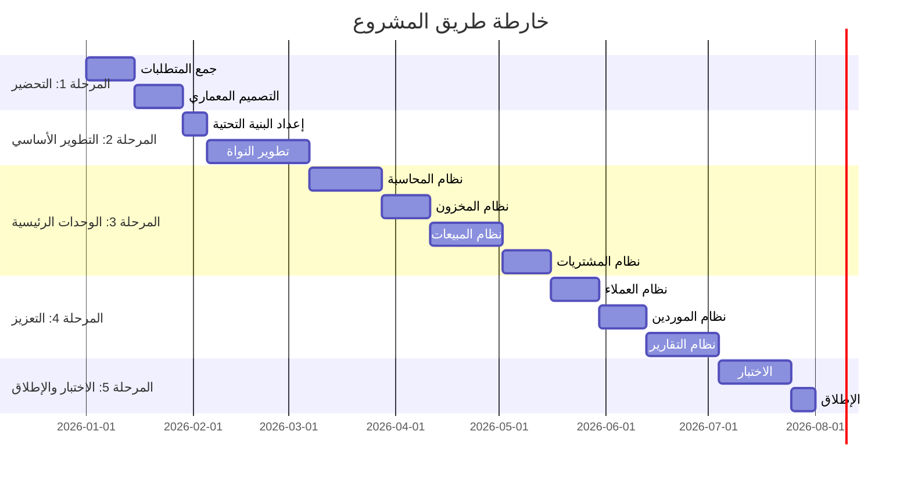
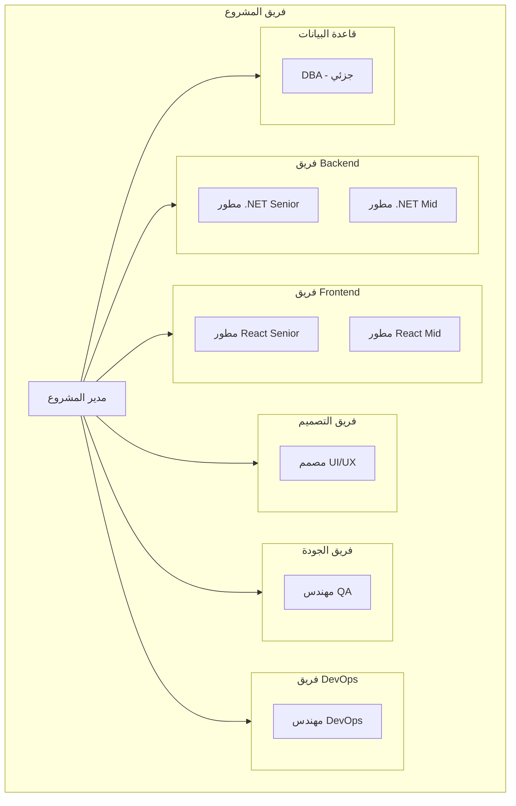
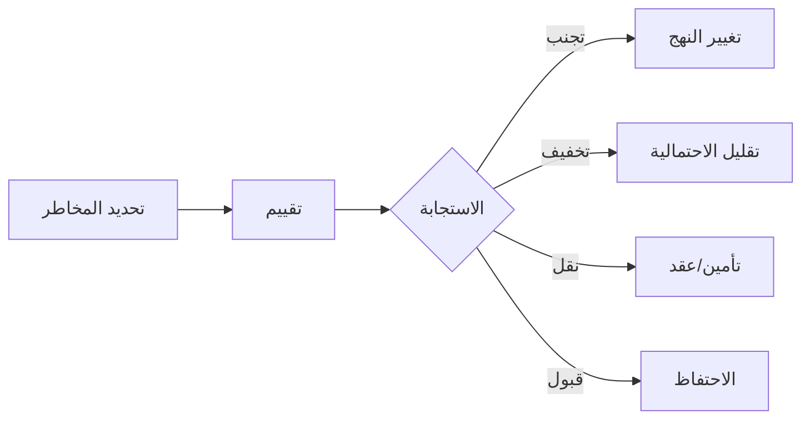

# 🗺️ خارطة المشروع

## 🎯 مقدمة

يقدم هذا المستند خارطة طريق المشروع الكاملة مع الجدول الزمني والموارد والمراحل.

---

## 📅 الجدول الزمني

---

## 📋 المراحل التفصيلية

### المرحلة 1: التحضير والتصميم (يناير 2026)

| المهمة | المدة | المسؤول | الحالة |
|--------|-------|---------|--------|
| جمع وتحليل المتطلبات | 2 أسابيع | محلل الأعمال | ✅ مكتمل |
| التصميم المعماري | 2 أسابيع | مهندس النظام | ✅ مكتمل |
| تصميم قاعدة البيانات | 1 أسبوع | DBA | ✅ مكتمل |
| تصميم الواجهات | 2 أسابيع | مصمم UI/UX | ✅ مكتمل |

### المرحلة 2: التطوير الأساسي (فبراير 2026)

| المهمة | المدة | المسؤول | الحالة |
|--------|-------|---------|--------|
| إعداد البنية التحتية | 1 أسبوع | DevOps | 🔄 قيد التنفيذ |
| تطوير النواة | 4 أسابيع | فريق Backend | 🔄 قيد التنفيذ |
| تطوير Frontend الأساسي | 4 أسابيع | فريق Frontend | 🔄 قيد التنفيذ |

### المرحلة 3: الوحدات الرئيسية (مارس - أبريل 2026)

| المهمة | المدة | المسؤول | الحالة |
|--------|-------|---------|--------|
| نظام المحاسبة | 3 أسابيع | فريق Backend | ⏳ مخطط |
| نظام المخزون | 2 أسابيع | فريق Backend | ⏳ مخطط |
| نظام المبيعات | 3 أسابيع | فريق Full Stack | ⏳ مخطط |
| نظام المشتريات | 2 أسابيع | فريق Full Stack | ⏳ مخطط |

### المرحلة 4: التعزيز (مايو 2026)

| المهمة | المدة | المسؤول | الحالة |
|--------|-------|---------|--------|
| نظام العملاء | 2 أسابيع | فريق Full Stack | ⏳ مخطط |
| نظام الموردين | 2 أسابيع | فريق Full Stack | ⏳ مخطط |
| نظام التقارير | 3 أسابيع | فريق Full Stack | ⏳ مخطط |
| نظام الإشعارات | 1 أسبوع | فريق Backend | ⏳ مخطط |

### المرحلة 5: الاختبار والإطلاق (يونيو 2026)

| المهمة | المدة | المسؤول | الحالة |
|--------|-------|---------|--------|
| اختبار الوحدة | 1 أسبوع | QA | ⏳ مخطط |
| اختبار التكامل | 1 أسبوع | QA | ⏳ مخطط |
| اختبار القبول | 1 أسبوع | QA + العميل | ⏳ مخطط |
| الإطلاق | 1 أسبوع | DevOps | ⏳ مخطط |

---

## 👥 فريق المشروع

### التكوين

### جدول الموارد

| الدور | العدد | الجهد | المدة |
|-------|-------|-------|-------|
| مدير المشروع | 1 | 100% | 6 أشهر |
| مطور Backend Senior | 1 | 100% | 6 أشهر |
| مطور Backend Mid | 1 | 100% | 6 أشهر |
| مطور Frontend Senior | 1 | 100% | 6 أشهر |
| مطور Frontend Mid | 1 | 100% | 6 أشهر |
| مصمم UI/UX | 1 | 50% | 6 أشهر |
| مهندس QA | 1 | 50% | 6 أشهر |
| مهندس DevOps | 1 | 25% | 6 أشهر |
| DBA | 1 | 10% | 6 أشهر |

---

## 💰 الميزانية

### التكلفة التقديرية

| البند | التكلفة (ريال سعودي) |
|-------|----------------------|
| **الموارد البشرية** | 1,200,000 |
| البرمجيات والتراخيص | 50,000 |
| البنية التحتية (6 أشهر) | 30,000 |
| الأدوات والخدمات | 20,000 |
| **الإجمالي** | **1,300,000** |

### تفصيل الموارد البشرية

| الدور | الراتب الشهري | المدة | الإجمالي |
|-------|---------------|-------|----------|
| مدير المشروع | 30,000 | 6 | 180,000 |
| مطور Backend Senior | 25,000 | 6 | 150,000 |
| مطور Backend Mid | 18,000 | 6 | 108,000 |
| مطور Frontend Senior | 25,000 | 6 | 150,000 |
| مطور Frontend Mid | 18,000 | 6 | 108,000 |
| مصمم UI/UX | 20,000 | 3 | 60,000 |
| مهندس QA | 18,000 | 3 | 54,000 |
| مهندس DevOps | 25,000 | 1.5 | 37,500 |
| DBA | 30,000 | 0.6 | 18,000 |

---

## 📊 المخاطر

### مصفوفة المخاطر

| المخاطر | الاحتمالية | التأثير | الاستراتيجية |
|---------|------------|---------|--------------|
| تأخر التطوير | متوسط | عالي | تخصيص وقت احتياطي |
| تغير المتطلبات | عالي | متوسط | Agile methodology |
| نقص الموارد | منخفض | عالي | خطط بديلة |
| مشاكل تقنية | متوسط | متوسط | اختبار مبكر |

### خطة التخفيف

---

## 📈 المؤشرات الرئيسية

### KPIs

| المؤشر | الهدف | القياس |
|--------|-------|--------|
| الالتزام بالجدول | > 90% | نسبة المهام في الوقت |
| جودة الكود | > 80% | تغطية الاختبارات |
| رضا العميل | > 80% | استبيان |
| ميزانية | < 110% | الفرق عن المخطط |

---

**الوثيقة:** خارطة المشروع  
**الإصدار:** 1.0  
**تاريخ التحديث:** 2026-03-07
