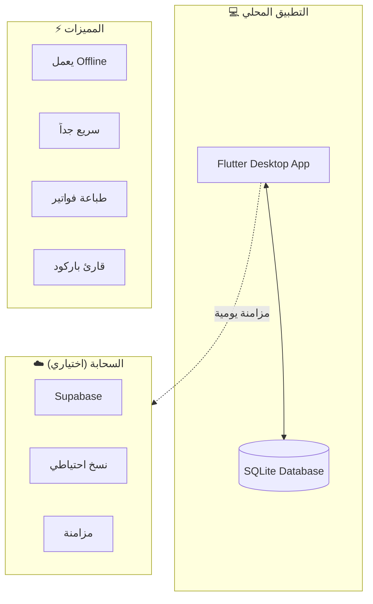
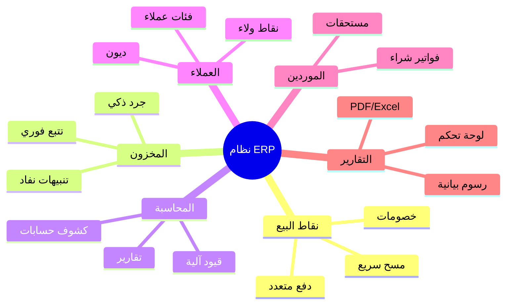
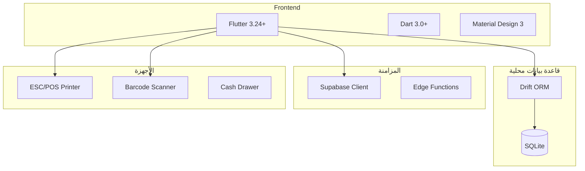

# 🏪 نظام ERP للمحلات التجارية - Flutter Desktop

<p align="center">
  
</p>

<p align="center">
  <strong>نظام إدارة متكامل للمحلات التجارية والسوبر ماركت</strong>
</p>

<p align="center">
  
  
  
  
</p>

<p align="center">
  <a href="#-نظرة-عامة">نظرة عامة</a> •
  <a href="#-المميزات">المميزات</a> •
  <a href="#-التقنيات">التقنيات</a> •
  <a href="#-الوثائق">الوثائق</a> •
  <a href="#-البدء-السريع">البدء السريع</a>
</p>

---

## 📋 نظرة عامة

نظام **ERP المتكامل** هو تطبيق سطح مكتب (Windows) مصمم خصيصاً للمحلات التجارية والسوبر ماركت. يعمل **Offline بالكامل** مع مزامنة ذكية للبيانات عند توفر الإنترنت.

### 🎯 المفهوم الأساسي



---

## ✨ المميزات

### المميزات الرئيسية

| الميزة | الوصف |
|--------|-------|
| 🌐 **يعمل Offline** | لا يحتاج إنترنت للعمل اليومي |
| ⚡ **سريع** | استجابة فورية (SQLite محلي) |
| 🖨️ **طباعة فواتير** | دعم الطابعات الحرارية (EPSON, etc.) |
| 📱 **باركود** | قارئ باركود USB/Bluetooth |
| 💾 **نسخ احتياطي** | مزامنة يومية مع Supabase |
| 🔒 **آمن** | تشفير البيانات المحلية |

### الوحدات النظامية



---

## 🛠️ التقنيات

### Stack التقني



### الحزم الرئيسية

```yaml
# pubspec.yaml
dependencies:
  flutter:
    sdk: flutter
  
  # Database
  drift: ^2.18.0
  drift_flutter: ^0.1.0
  sqlite3_flutter_libs: ^0.5.20
  
  # Sync
  supabase_flutter: ^2.5.0
  
  # Printing
  esc_pos_printer: ^4.1.0
  esc_pos_utils: ^1.1.0
  
  # UI
  fluent_ui: ^4.9.0
  flutter_riverpod: ^2.5.0
  fl_chart: ^0.68.0
  
  # Utils
  intl: ^0.19.0
  path_provider: ^2.1.3
  share_plus: ^9.0.0
  pdf: ^3.10.0
```

---

## 📁 هيكل المشروع

```
flutter_erp/
├── lib/
│   ├── main.dart                    # نقطة الدخول
│   ├── app.dart                     # تطبيق MaterialApp
│   │
│   ├── core/                        # الأساسيات
│   │   ├── constants/               # الثوابت
│   │   ├── theme/                   # الثيمات
│   │   ├── utils/                   # الأدوات
│   │   └── extensions/              # الامتدادات
│   │
│   ├── data/                        # البيانات
│   │   ├── database/                # قاعدة البيانات
│   │   │   ├── database.dart        # Drift Database
│   │   │   ├── tables/              # الجداول
│   │   │   └── daos/                # DAOs
│   │   ├── models/                  # النماذج
│   │   └── repositories/            # المستودعات
│   │
│   ├── services/                    # الخدمات
│   │   ├── sync_service.dart        # مزامنة Supabase
│   │   ├── print_service.dart       # طباعة الفواتير
│   │   ├── barcode_service.dart     # قارئ الباركود
│   │   └── backup_service.dart      # النسخ الاحتياطي
│   │
│   ├── providers/                   # Riverpod Providers
│   │   ├── auth_provider.dart
│   │   ├── cart_provider.dart
│   │   ├── inventory_provider.dart
│   │   └── settings_provider.dart
│   │
│   ├── screens/                     # الشاشات
│   │   ├── pos/                     # نقطة البيع
│   │   ├── inventory/               # المخزون
│   │   ├── accounting/              # المحاسبة
│   │   ├── customers/               # العملاء
│   │   ├── suppliers/               # الموردين
│   │   ├── reports/                 # التقارير
│   │   └── settings/                # الإعدادات
│   │
│   └── widgets/                     # المكونات المشتركة
│       ├── common/                  # عامة
│       ├── pos/                     # POS
│       └── charts/                  # رسوم بيانية
│
├── assets/                          # الأصول
│   ├── images/
│   ├── fonts/
│   └── icons/
│
├── windows/                         # إعدادات Windows
├── test/                            # الاختبارات
└── pubspec.yaml
```

---

## 📚 الوثائق

| الوثيقة | الوصف |
|---------|-------|
| [📋 نظرة عامة](docs/01-System-Overview.md) | مقدمة شاملة عن النظام |
| [📊 تحليل المتطلبات](docs/02-Requirements-Analysis.md) | المتطلبات الوظيفية وغير الوظيفية |
| [🧩 الوحدات النظامية](docs/03-System-Modules.md) | هيكل الوحدات والتكامل |
| [💾 قاعدة البيانات](docs/04-Database-Design.md) | تصميم SQLite + الجداول |
| [🔄 نظام المزامنة](docs/05-Sync-System.md) | مزامنة Supabase |
| [🖥️ بنية التطبيق](docs/06-App-Architecture.md) | هيكل Flutter |
| [🎨 تصميم الواجهات](docs/07-UI-Design.md) | UI/UX للشاشات |
| [🖨️ نظام الطباعة](docs/08-Printing-System.md) | طباعة الفواتير |
| [📡 API التكامل](docs/09-API-Integration.md) | Supabase APIs |
| [🔒 الأمان](docs/10-Security.md) | حماية البيانات |
| [🧪 خطة الاختبار](docs/11-Testing-Plan.md) | استراتيجية الاختبار |
| [🚀 خطة النشر](docs/12-Deployment.md) | بناء EXE للعملاء |

---

## 🚀 البدء السريع

### المتطلبات

- Flutter 3.24+
- Dart 3.0+
- Windows 10/11
- Visual Studio 2022 (مع C++ workload)

### التثبيت

```bash
# 1. استنساخ المشروع
git clone https://github.com/yourusername/flutter-erp.git
cd flutter_erp

# 2. تثبيت التبعيات
flutter pub get

# 3. بناء للـ Windows
flutter build windows --release

# 4. تشغيل
flutter run -d windows
```

---

## 👨‍💻 المطور

تم التطوير بواسطة: **[اسمك]**

---

<p align="center">
  Made with ❤️ using Flutter
</p>
