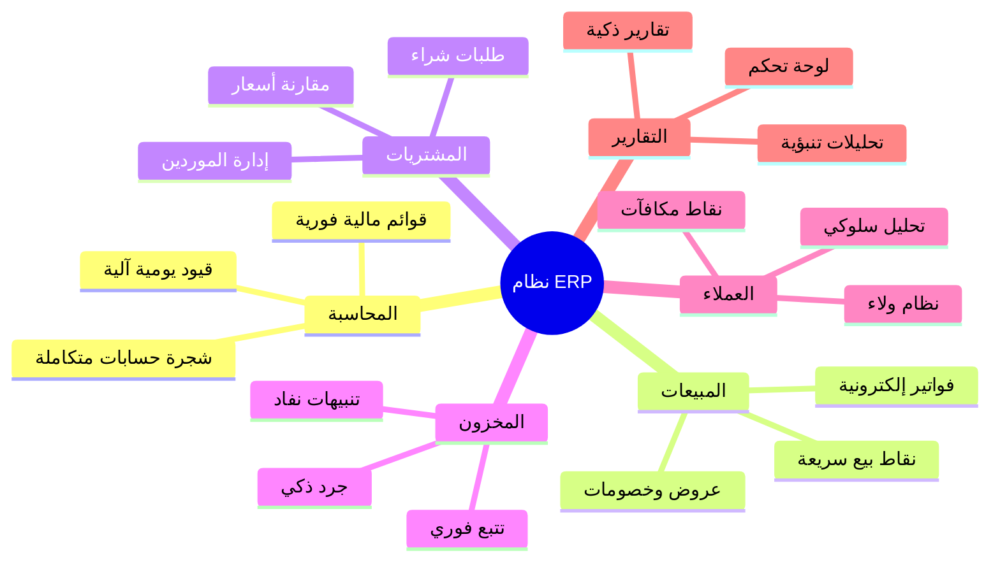
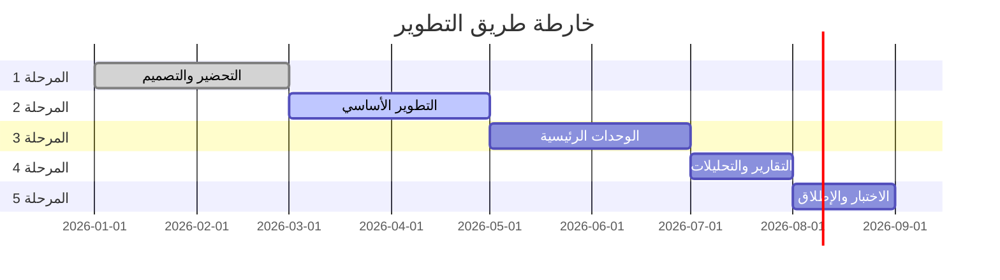
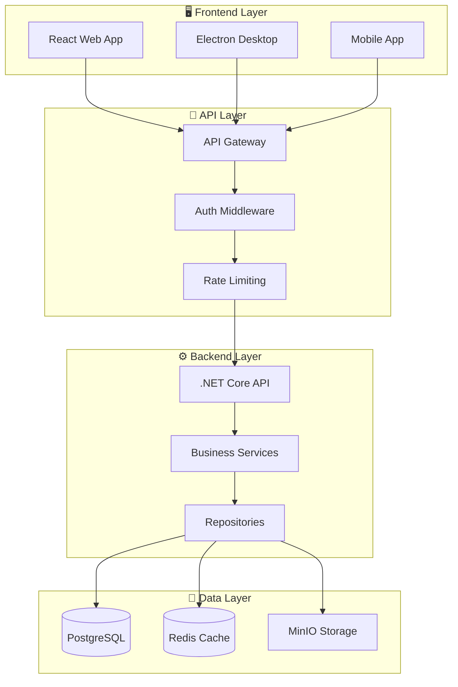

# 🏪 نظام ERP المتكامل للمحلات التجارية

<p align="center">
  
</p>

<p align="center">
  <a href="#-نظرة-عامة">نظرة عامة</a> •
  <a href="#-المميزات-الرئيسية">المميزات</a> •
  <a href="#-الوحدات-النظامية">الوحدات</a> •
  <a href="#-stack-التقني">Stack التقني</a> •
  <a href="#-خارطة-الطريق">خارطة الطريق</a> •
  <a href="#-التوثيق">التوثيق</a>
</p>

<p align="center">
  
  
  
  
</p>

---

## 📋 نظرة عامة

نظام **ERP المتكامل** هو حل برمجي شامل مصمم خصيصاً للمحلات التجارية والسوبر ماركت. يوفر النظام إدارة متكاملة لجميع العمليات التجارية والمحاسبية مع واجهة سهلة الاستخدام وأداء عالي.

### 🎯 الأهداف الرئيسية

- **⚡ الكفاءة**: تسريع العمليات اليومية وتقليل الوقت المهدور
- **📊 الشفافية**: رؤية شاملة لجميع العمليات في الوقت الفعلي
- **🔒 الأمان**: حماية البيانات والمعاملات بأعلى معايير الأمان
- **📈 القابلية للتوسع**: دعم النمو من فرع واحد إلى شبكة فروع

---

## ✨ المميزات الرئيسية



---

## 🧩 الوحدات النظامية

| الوحدة | الوصف | الحالة |
|--------|-------|--------|
| 📊 [المحاسبة](docs/04-Accounting-System.md) | شجرة الحسابات، القيود اليومية، القوائم المالية | ✅ جاهز |
| 🛒 [المبيعات](docs/05-Sales-System.md) | نقاط البيع، الفواتير، المرتجعات | ✅ جاهز |
| 📦 [المشتريات](docs/06-Purchase-System.md) | طلبات الشراء، فواتير الموردين | ✅ جاهز |
| 📋 [المخزون](docs/07-Inventory-System.md) | المنتجات، المستودعات، الجرد | ✅ جاهز |
| 👥 [العملاء](docs/08-Customer-System.md) | إدارة العملاء، النقاط، الولاء | ✅ جاهز |
| 🏭 [الموردين](docs/09-Supplier-System.md) | تقييم الموردين، العقود | ✅ جاهز |
| 📈 [التقارير](docs/10-Reporting-System.md) | لوحة التحكم، التحليلات | ✅ جاهز |

---

## 🛠️ Stack التقني

### Frontend
```
React 18+ • TypeScript • Tailwind CSS • shadcn/ui • React Query • Zustand
```

### Backend
```
.NET 8 • ASP.NET Core • Entity Framework • PostgreSQL • Redis
```

### Infrastructure
```
Docker • Kubernetes • Nginx • RabbitMQ • SignalR
```

<p align="center">
  
  
  
  
  
</p>

---

## 🗺️ خارطة الطريق



### المراحل التفصيلية

| المرحلة | المدة | المخرجات |
|---------|-------|----------|
| **الإطلاق** (3-4 أشهر) | يناير - أبريل | النظام الأساسي |
| **التعزيز** (2-3 أشهر) | مايو - يوليو | العروض، الولاء، الفروع |
| **الابتكار** (2-3 أشهر) | أغسطس - أكتوبر | موبايل، AI، تكاملات |
| **التوسع** (مستمر) | نوفمبر+ | تحسينات مستمرة |

---

## 📚 التوثيق

### 📖 الوثائق الرئيسية

| الوثيقة | الوصف |
|---------|-------|
| [📋 نظرة عامة](docs/01-System-Overview.md) | مقدمة شاملة عن النظام |
| [📊 تحليل الأعمال](docs/02-Business-Analysis.md) | تحليل المتطلبات والعمليات |
| [🧩 الوحدات النظامية](docs/03-System-Modules.md) | هيكل الوحدات والتكامل |
| [💾 قاعدة البيانات](docs/11-Database-Design.md) | تصميم قاعدة البيانات |
| [🏗️ بنية النظام](docs/12-System-Architecture.md) | البنية التقنية والتصميم |
| [🔒 الأمان](docs/15-Security-System.md) | استراتيجية الأمان |

### 🔧 الوثائق التقنية

| الوثيقة | الوصف |
|---------|-------|
| [⚙️ Stack التقني](docs/13-Technology-Stack.md) | التقنيات والأدوات |
| [🎨 تصميم الواجهات](docs/14-UI-UX-Design.md) | UI/UX ومبادئ التصميم |
| [🚀 بنية النشر](docs/18-Deployment-Architecture.md) | استراتيجية النشر |
| [📱 التوسع المستقبلي](docs/19-Future-Expansion.md) | خطط التطوير المستقبلية |

---

## 🏛️ بنية النظام



---

## 🚀 البدء السريع

### متطلبات النظام

- **Node.js** 18+
- **.NET SDK** 8.0+
- **PostgreSQL** 15+
- **Docker** (اختياري)

### خطوات التثبيت

```bash
# 1. استنساخ المستودع
git clone https://github.com/your-org/erp-system.git
cd erp-system

# 2. تثبيت تبعيات Frontend
cd src/ERP.Web
npm install

# 3. تثبيت تبعيات Backend
cd ../ERP.API
dotnet restore

# 4. تشغيل قاعدة البيانات
docker-compose up -d postgres redis

# 5. تشغيل التطبيق
dotnet run
```

---

## 👥 الفريق

| الدور | العدد |
|-------|-------|
| مدير المشروع | 1 |
| مطور Backend (.NET) | 2 |
| مطور Frontend (React) | 2 |
| مصمم UI/UX | 1 |
| مهندس QA | 1 |
| DBA | 1 (جزئي) |

---

## 📄 الترخيص

هذا المشروع مرخص بموجب [MIT License](LICENSE).

---

<p align="center">
  Made with ❤️ for Retail Excellence
</p>

<p align="center">
  <a href="mailto:contact@erpsystem.com">📧 تواصل معنا</a> •
  <a href="https://erpsystem.com">🌐 الموقع الرسمي</a> •
  <a href="https://docs.erpsystem.com">📖 التوثيق الكامل</a>
</p>
